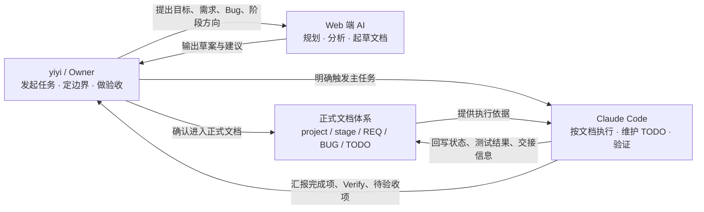
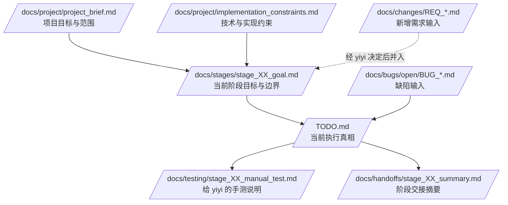
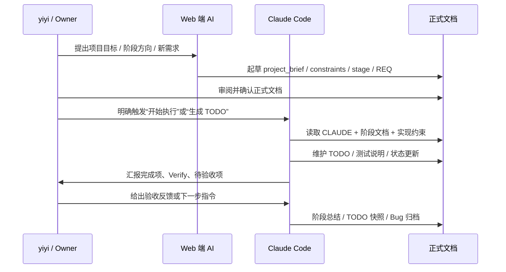

# Docs is all you need

> 一个面向任意项目的 **文档驱动开发（Docs-Driven Development）脚手架**。  
> 用正式文档明确边界，用 `/TODO.md` 驱动执行，用多智能体协作降低上下文漂移。

## 一句话理解

**Docs is all you need** 不是一个代码框架，而是一套给人类 Owner、Web 端 AI、Claude Code 共同使用的 **项目文档操作系统**。

它解决的是这类问题：

- 聊天记录很多，但真正生效的结论不清楚。
- Web 端 AI 会规划，但上下文不稳定，容易遗漏历史约束。
- Claude Code 能执行，但如果没有清晰文档边界，就容易越权、误判阶段范围或做出“看起来合理”的错误决策。
- 项目一旦跨阶段、跨会话、跨 AI 接力，信息就开始断层。

这个脚手架的核心想法很简单：

> **让文档不是“事后补充材料”，而是“协作接口、执行依据和验收凭证”。**

---

## 这套脚手架适合谁

适合：

- 正在用 ChatGPT / Claude Web / Claude Code 辅助开发的个人开发者
- 需要“项目 Owner + Web AI + CLI AI 执行体”协作的任意项目
- 希望把需求、阶段、缺陷、测试、交接显式化的团队
- 想减少“AI 理解错上下文”“边界漂移”“重复解释项目背景”的人

暂时不太适合：

- 完全不愿意维护正式文档，只想靠聊天直接推进的项目
- 一次性脚本、极小型实验代码，且没有阶段协作需求的场景
- 不希望区分“规划”和“执行”边界的工作流

---

## 核心理念

### 1. 文档优先于对话

聊天可以提出想法，但**进入正式文档**后，内容才应该成为可持续流转的项目事实。

### 2. `/TODO.md` 是执行真相，但不是一切真相

- `/TODO.md`：记录当前任务拆解、状态、验证结果、待手测项
- `stage_XX_goal.md`：定义当前阶段做什么、不做什么、如何验收
- `implementation_constraints.md`：定义长期有效的技术与实现约束
- `CLAUDE.md`：定义 Claude Code 的读取顺序、权限边界、测试与停止规则

也就是说：

> **TODO 决定“现在在做什么”，阶段文档决定“这一阶段该做什么”，实现约束决定“哪些做法根本不能碰”。**

### 3. 报告默认不直接驱动执行

分析报告、对比报告、调查报告、总结报告主要用于帮助理解与决策。  
如果某个结论真的要落地，应该再同步写回：

- `stage_XX_goal.md`
- `REQ_*.md`
- `BUG_*.md`
- `/TODO.md`

### 4. 协作边界必须显式化

这套脚手架故意把三类能力拆开：

- **yiyi / Owner**：发起任务、定边界、做验收
- **Web 端 AI**：规划、分析、起草文档
- **Claude Code**：读取正式文档后执行代码、维护 TODO、配合测试与归档

这样做的目的不是增加流程，而是避免“谁都能改、谁都在猜、最后谁都说不清”。

---

## 三方协作模型

> 仓库里使用了 `yiyi` 这个名字来代表“人类项目 Owner”。如果你在自己的项目里使用这套脚手架，可以直接把它理解为 **Owner / PM / 负责人**。



### 三者各自负责什么

| 角色 | 负责内容 | 不负责内容 |
|---|---|---|
| yiyi / Owner | 决定开始什么、当前阶段范围、什么算完成 | 不需要亲自维护所有过程文档 |
| Web 端 AI | 规划、起草、整理、比较、补充需求文档 | 不默认持有项目长期上下文，不直接执行代码 |
| Claude Code | 严格按文档执行、维护 `/TODO.md`、配合测试与归档 | 不替 Owner 决定阶段边界、需求归属和是否收尾 |

---

## 文档如何驱动执行



### 关键理解

1. **项目背景**先进入 `project_brief.md`
2. **长期约束**写进 `implementation_constraints.md`
3. **本阶段范围**写进 `stage_XX_goal.md`
4. Claude Code 只有在被明确触发后，才会基于这些文档生成或维护 `/TODO.md`
5. 执行过程中产生的待验收项、手测项、验证结果，持续沉淀到 `/TODO.md` 和测试文档
6. 阶段结束后，再输出 `stage_XX_summary.md` 与 TODO 快照

---

## 这套仓库里有什么

当前仓库包含的是 **一套可复用的文档模板骨架**，不是某个具体业务项目的实例文档。

```text
.
├── README.md
├── CLAUDE.md
├── TODO.md
└── docs/
    ├── meta/
    │   ├── docs_framework_overview.md
    │   └── collaboration_workflow_guide.md
    ├── project/
    │   ├── project_brief.md
    │   ├── implementation_constraints.md
    │   ├── architecture_overview.md
    │   └── file_index.md
    ├── stages/
    │   └── stage_XX_goal.md
    ├── changes/
    │   └── REQ_template.md
    ├── testing/
    │   ├── test_strategy.md
    │   └── manual_test_template.md
    ├── bugs/
    │   ├── open/
    │   │   └── BUG_template.md
    │   └── closed/
    ├── handoffs/
    │   └── stage_summary_template.md
    ├── TODO_backup/
    └── reports/
        ├── analysis/
        │   └── ANALYSIS_template.md
        ├── comparison/
        │   └── COMPARISON_template.md
        ├── survey/
        │   └── SURVEY_template.md
        └── summary/
            └── SUMMARY_template.md
```

---

## 文档分层速览

| 文档 | 作用 | 是否直接驱动执行 | Claude Code 权限 |
|---|---|---|---|
| `CLAUDE.md` | 项目级执行规则入口 | 间接驱动 | 询问后可改 |
| `/TODO.md` | 当前任务执行真相 | **是** | 自动可改 |
| `project_brief.md` | 项目目标、范围、非目标 | 否 | 只读 |
| `implementation_constraints.md` | 技术、依赖、架构、部署、安全约束 | **是** | 只读 |
| `stage_XX_goal.md` | 当前阶段范围、交付项、Verify | **是** | 询问后可改 |
| `REQ_*.md` | 新增需求输入 | 否（需 Owner 决定是否并入） | 只读 |
| `BUG_*.md` | 缺陷输入与修复验收依据 | 否（需 Owner 明确触发修复） | 只读 |
| `test_strategy.md` | 测试分工、原则、命令、停止规则 | 间接驱动 | 询问后可改 |
| `stage_XX_manual_test.md` | 给 yiyi 的手动测试说明 | 间接驱动 | 自动可改 |
| `stage_XX_summary.md` | 阶段交接摘要 | 否 | 询问后可改 |
| `reports/**` | 认知辅助文档（分析 / 对比 / 调查 / 总结） | 默认否 | 询问后可改 |

---

## 10 分钟快速上手

### Step 1：把脚手架放进你的项目

你可以把这套目录直接复制到任意项目根目录下：

```bash
# 示例：将解压后的脚手架复制到你的项目根目录
cp -R docs_is_all_you_need/* your-project/
```

### Step 2：先填 3 份最关键的文档

建议优先完成：

1. `docs/project/project_brief.md`
2. `docs/project/implementation_constraints.md`
3. `docs/stages/stage_01_goal.md`

这是让项目进入“可执行状态”的最小集合。

### Step 3：确认 `CLAUDE.md`

`CLAUDE.md` 决定 Claude Code：

- 先读哪些文档
- 哪些动作默认做
- 哪些动作必须由 Owner 明确触发
- 哪些文档可以改、哪些只能读
- 什么时候应该停下来等下一步指令

### Step 4：让 Claude Code 生成或重整 `/TODO.md`

在阶段文档和实现约束确认后，再让 Claude Code 生成当前阶段的 `/TODO.md`。  
这样 TODO 才会真正成为“基于正式文档”的执行真相，而不是随手列出来的 checklist。

### Step 5：按 TODO 执行与验收

执行过程中：

- Claude Code 负责开发、修复、测试配合、维护 TODO
- yiyi 负责关键决策与最终验收
- Web 端 AI 负责补充 REQ、分析报告、下一阶段草案等

### Step 6：阶段结束后沉淀交接信息

阶段收尾时，输出：

- `docs/handoffs/stage_XX_summary.md`
- `docs/TODO_backup/TODO_YYYYMMDD_HH.md`
- 需要的话补充 `docs/reports/**`

---

## 一次完整协作长什么样



---

## 模板文件如何变成正式文档

这套仓库里有一些文件已经是正式名称，有些还是“模板占位名”。使用时建议按下面方式落地：

| 当前文件 | 实际使用时建议命名 |
|---|---|
| `docs/stages/stage_XX_goal.md` | `docs/stages/stage_01_goal.md`、`stage_02_goal.md` |
| `docs/changes/REQ_template.md` | `docs/changes/REQ_20260420_login_rate_limit.md` |
| `docs/testing/manual_test_template.md` | `docs/testing/stage_01_manual_test.md` |
| `docs/bugs/open/BUG_template.md` | `docs/bugs/open/BUG_20260420_checkout_crash.md` |
| `docs/handoffs/stage_summary_template.md` | `docs/handoffs/stage_01_summary.md` |
| `docs/reports/analysis/ANALYSIS_template.md` | `docs/reports/analysis/ANALYSIS_20260420_api_cache.md` |
| `docs/reports/comparison/COMPARISON_template.md` | `docs/reports/comparison/COMPARISON_20260420_auth方案.md` |
| `docs/reports/survey/SURVEY_template.md` | `docs/reports/survey/SURVEY_20260420_error_boundary.md` |
| `docs/reports/summary/SUMMARY_template.md` | `docs/reports/summary/SUMMARY_20260420_stage01.md` |

---

## 推荐使用姿势

### 用 Web 端 AI 做什么

适合让 Web 端 AI：

- 起草 `project_brief.md`
- 起草 `implementation_constraints.md`
- 起草 `stage_XX_goal.md`
- 整理 `REQ_*.md`
- 产出 `analysis / comparison / survey / summary` 报告
- 在阶段交接时，基于总结重新起草下一阶段目标

### 用 Claude Code 做什么

适合让 Claude Code：

- 严格按文档执行代码修改
- 维护 `/TODO.md`
- 维护 `stage_XX_manual_test.md`
- 在授权条件满足时，执行必要测试、继续修复、阶段收尾、TODO 快照和 bug 归档

### 用 yiyi / Owner 做什么

Owner 的关键职责不是“写完所有文档”，而是：

- 触发关键动作
- 决定边界
- 判断某个 REQ 是否并入当前阶段
- 判断某个 BUG 是否现在处理
- 做最终验收
- 决定某些动作以后能不能自动化

---

## 给第一次使用者的最小工作流

如果你是第一次把这套脚手架落到真实项目里，可以直接按下面顺序开始：

1. 写清楚 `project_brief.md`，不要急着写代码。
2. 写清楚 `implementation_constraints.md`，把技术边界钉住。
3. 起草 `stage_01_goal.md`，只定义当前阶段，不要偷塞未来需求。
4. 确认 `CLAUDE.md` 里的读取顺序、权限和停止规则。
5. 明确告诉 Claude Code：**根据阶段文档与实现约束生成 `/TODO.md`。**
6. 再明确告诉 Claude Code：**开始推进当前阶段。**
7. 执行过程中，把新增需求放进 `REQ_*.md`，把新发现缺陷放进 `BUG_*.md`。
8. 阶段完成后，生成 `stage_XX_summary.md` 与 TODO 快照。

这 8 步跑通后，你的项目就会形成一套可复用的、可交接的 AI 协作闭环。

---

## 可以直接复制的提示词

### 给 Web 端 AI 的提示词

```text
请基于这个 docs 脚手架，为我的项目起草以下文档：
1. /docs/project/project_brief.md
2. /docs/project/implementation_constraints.md
3. /docs/stages/stage_01_goal.md

要求：
- 严格区分项目级背景、长期实现约束、当前阶段目标
- 不要把 TODO 级任务拆解写进阶段文档
- 保持可验证、可交接、可供 Claude Code 读取执行
```

### 给 Claude Code 的提示词

```text
先阅读 /CLAUDE.md，然后按其中的默认读取规则，读取当前任务所需的最小必要文档。
基于 /docs/stages/stage_01_goal.md 与 /docs/project/implementation_constraints.md 生成 /TODO.md。
随后严格按文档推进实现、测试和状态维护。
所有任务都必须包含明确的 Verify；不要越权修改只读文档；完成当前明确任务后按规则停止。
```

---

## 设计亮点

### 1. 把“谁能改什么”写清楚

很多 AI 协作失败，不是因为模型能力不够，而是因为**权限边界不清楚**。  
这套脚手架直接把文档分成：

- 自动可改
- 询问后可改
- 只读
- 仅归档操作

这样 Claude Code 的行为会稳定很多。

### 2. 把“是否开始做”与“怎么做”拆开

比如：

- 看到了 `REQ_*.md`，**不等于自动开始开发**
- 看到了 `BUG_*.md`，**不等于自动开始修复**
- 文档更新完成，**不等于自动继续执行下一步**

这让 Owner 始终掌握关键节奏。

### 3. 把 Verify 写进文档骨架

这套模板刻意让 `/TODO.md`、`stage_XX_goal.md`、`REQ_*.md`、`BUG_*.md`、手测文档都显式包含：

- 前置依赖
- 验收标准（Verify）
- 测试步骤 / 观察方式

好处是 Claude Code 不容易“口头上说完成”，而是必须回到可验证结果。

### 4. 既适合当前执行，也适合后续交接

这套脚手架不只解决“怎么做”，还解决：

- 下一轮对话怎么接
- 下一阶段怎么开始
- 换一个 Web AI 怎么快速理解项目
- 为什么某个决策当时成立

---

## 常见问题

<details>
<summary><strong>为什么不直接靠聊天记录推进项目？</strong></summary>

因为聊天记录天然不稳定：上下文窗口有限、会话会切换、不同 AI 看不到同样的历史，而且“哪一句话算正式决定”通常并不清楚。

这套脚手架的目标，是把真正生效的事实沉淀到正式文档中，让它可以被复用、验证和交接。
</details>

<details>
<summary><strong>这套脚手架只能配合 Claude Code 使用吗？</strong></summary>

不是。它的核心是“文档驱动协作”，不是绑定某个特定工具。

只是当前这套设计里，`CLAUDE.md` 明确承接了 Claude Code 的读取顺序、权限边界和停止规则，所以和 Claude Code 的配合会最顺手。
</details>

<details>
<summary><strong>为什么已经有 stage 文档了，还需要 TODO？</strong></summary>

因为两者职责不同：

- `stage_XX_goal.md` 负责阶段边界、交付项和验收标准
- `/TODO.md` 负责把当前轮执行拆解成可推进、可验证、可维护状态的任务清单

一个是“做什么”，一个是“怎么推进当前轮执行”。
</details>

<details>
<summary><strong>报告类文档既然不直接驱动执行，为什么还要保留？</strong></summary>

因为项目里很多时候并不是“已经决定做什么”，而是还需要先理解、比较、调查或复盘。

报告类文档的价值，在于把这些中间认知显式沉淀下来；只是它们默认不直接成为执行指令，避免“分析结论”在没有被确认前静默进入开发流程。
</details>

---

## 一个实用建议

如果你准备把这套脚手架真正用起来，最值得坚持的一件事是：

> **任何会长期影响项目边界、阶段范围、实现约束或验收标准的内容，都不要只停留在聊天里。**

把它写回正式文档，你后面的所有 AI 协作成本都会下降。

---

## 最后

**Docs is all you need** 想做的不是“让文档变多”，而是“让协作变得可追踪、可验证、可接力”。

当项目开始依赖多个 AI、多个阶段、多个会话时，真正能把系统稳住的，往往不是更多提示词，而是更清晰的文档边界。

如果你认同这点，这个脚手架就是给你准备的。
