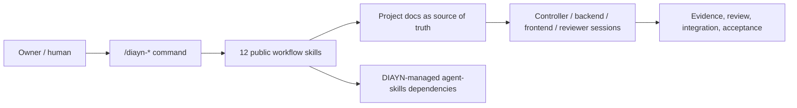
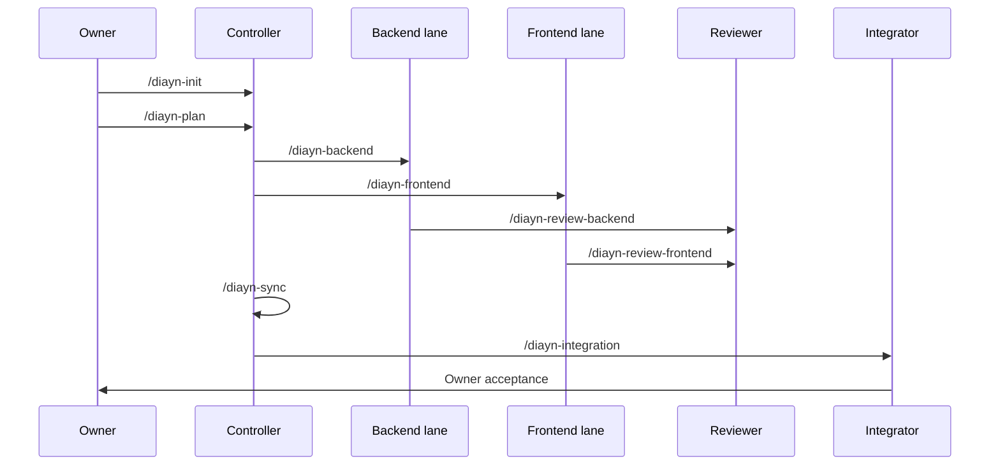

# Docs-is-all-you-need

[Chinese](README.zh-CN.md)

Docs-is-all-you-need, or DIAYN, is a document-driven multi-session coding-agent
collaboration control plane delivered as an installable skill pack.

DIAYN V1 exposes exactly 12 public `/diayn-*` workflow skills. Internal roles
such as Controller, Executor, Reviewer, Integrator, Identity Guard, Owner UX,
and Skill Router are implementation references, not extra public commands.



## Install

For Codex Desktop, install the Codex Home skill package from this repository.
Run these commands from the repository root. Start with a dry-run:

```powershell
node maintainers\scripts\install_codex_project_local_package.js --target-codex-home $env:USERPROFILE\.codex
```

If the dry-run looks correct, execute the install:

```powershell
node maintainers\scripts\install_codex_project_local_package.js --target-codex-home $env:USERPROFILE\.codex --execute
```

This installs:

- 12 public DIAYN workflow skills into `$CODEX_HOME/skills`;
- 23 DIAYN-managed `agent-skills` dependency skills;
- DIAYN metadata into `$CODEX_HOME/diayn/docs-is-all-you-need`.

The install command does not delete existing user skills. If old DIAYN test
skills are present, clean them intentionally before reinstalling.

After installation, open or reload Codex Desktop and start the target project
with:

```text
/diayn-init
```

## Public Commands

```text
/diayn-init
/diayn-plan
/diayn-worktrees
/diayn-backend
/diayn-frontend
/diayn-review-backend
/diayn-review-frontend
/diayn-sync
/diayn-integration
/diayn-bug
/diayn-new
/diayn-html
```



## What Is In This Repository

| Path | Purpose |
| --- | --- |
| `skills/` | DIAYN source workspace. It includes public workflow source plus internal/historical source. It is not the install surface. |
| `plugins/docs-is-all-you-need/skills/` | Codex plugin candidate public surface with exactly 12 DIAYN workflow skills. |
| `packages/codex-project-local/` | Codex project-local/Home install package. |
| `packages/claude-project-local/` | Claude Code project-local package with completed installed-flow evidence. |
| `plugins/docs-is-all-you-need/dependency-skills/` | Locked DIAYN-managed third-party `agent-skills` payload. |
| `validation/` | Committed fixture evidence and release-gate outputs. Local runtime evidence is ignored. |

## Current Support Status

| Surface | Status |
| --- | --- |
| Claude Code project-local | Complete alpha surface for the validated fixture flow. |
| Codex Desktop | Package and install fixtures are ready; app-session runtime validation is manual and still pending. |
| OpenCode | Deferred until direct `/diayn-*` skill invocation is proven. |

Codex Desktop runtime validation must be performed inside Codex Desktop itself.
Do not use shell-launched Codex as runtime proof.

## Read Next

| Need | Read |
| --- | --- |
| Install/support truth | `docs/install/README.md` |
| Implementation phases | `docs/meta/diayn_v1_implementation_plan.md` |
| Completion audit | `docs/meta/diayn_v1_completion_audit.md` |
| Command behavior | `docs/meta/diayn_command_reference.md` |
| Root `skills/` explanation | `skills/README.md` |

Keep durable facts in repository documents. Keep chat for immediate
coordination, clarification, and user feedback.
