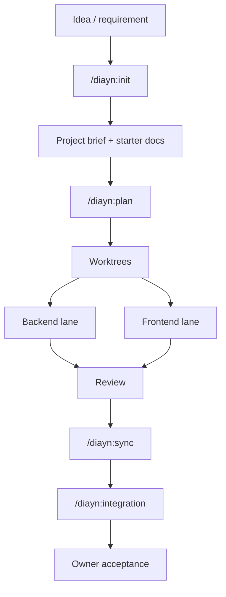
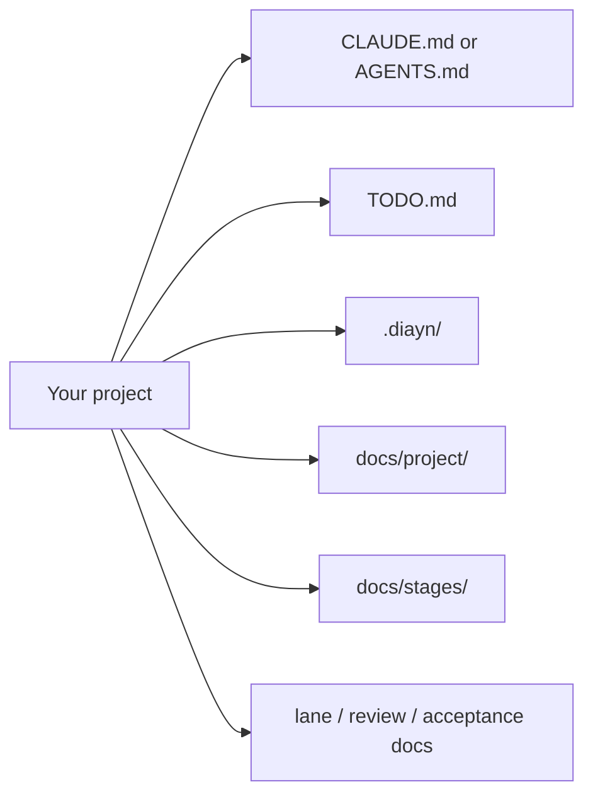

# Docs-is-all-you-need

[中文](README.zh-CN.md)

Docs-is-all-you-need, or DIAYN, is a document-driven workflow pack for
multi-session coding-agent work. It helps you turn a vague idea or requirement
into a project that can be planned, split into lanes, reviewed, synchronized,
and accepted without losing the project truth.

## Who It Is For

- Owners who want an idea turned into a clear project plan.
- Teams that work across multiple agent sessions and want one source of truth.
- Claude Code users who want a plugin-first workflow.

## Quick Start

### Claude Code Plugin Install

Copy these commands into Claude Code:

```text
/plugin marketplace add ice268528/Docs-is-all-you-need
/plugin install diayn@diayn-local-alpha
```

Then start with:

```text
/diayn:init
```

DIAYN will ask clarifying questions when needed, then create the project docs
and starter files it needs.

## Core Workflow



The review step can send work back to a lane when something needs more work.

## Common Commands

| Workflow | Command | When to use |
| --- | --- | --- |
| Init / retrofit | `/diayn:init` (`/diayn-init` in fallback) | Start from an idea, or set up DIAYN in an existing project. |
| Plan | `/diayn:plan` (`/diayn-plan`) | Turn the current goal into stages, tasks, and ownership. |
| Worktrees | `/diayn:worktrees` (`/diayn-worktrees`) | Prepare lane workspaces before implementation starts. |
| Backend lane | `/diayn:backend` (`/diayn-backend`) | Work on backend tasks for the current stage. |
| Frontend lane | `/diayn:frontend` (`/diayn-frontend`) | Work on frontend tasks for the current stage. |
| Backend review | `/diayn:review-backend` (`/diayn-review-backend`) | Review backend work before merge or handoff. |
| Frontend review | `/diayn:review-frontend` (`/diayn-review-frontend`) | Review frontend work before merge or handoff. |
| Sync docs/state | `/diayn:sync` (`/diayn-sync`) | Sync lane state, docs, and shared project truth. |
| Integration | `/diayn:integration` (`/diayn-integration`) | Check the combined result before closing a stage. |
| Bug triage | `/diayn:bug` (`/diayn-bug`) | Route a new bug or a surprising failure. |
| New stage | `/diayn:new` (`/diayn-new`) | Start the next stage or capture a new chunk of work. |
| HTML report | `/diayn:html` (`/diayn-html`) | Generate or refresh the HTML view of DIAYN docs. |

## What DIAYN Adds To Your Project



Typical generated or maintained files include:

- a platform entry file: `CLAUDE.md` or `AGENTS.md`
- `TODO.md` for the current project summary
- `.diayn/` for DIAYN control files and metadata
- `docs/project/` for the project brief and file index
- `docs/stages/` for stage-level docs
- lane, review, and acceptance docs for active work

## Other Installation Paths

- Claude project-local fallback: use this when you want bare `/diayn-*`
  commands inside a target project. See
  [docs/install/claude-code.md](docs/install/claude-code.md).
- Codex / OpenCode / generic: see
  [docs/install/README.md](docs/install/README.md) for the supported paths and
  setup notes.

## More Docs

If you want the details behind the user-facing quick start, read:

- [docs/install/README.md](docs/install/README.md)
- [docs/install/claude-code.md](docs/install/claude-code.md)
- [docs/qa/claude-plugin-runtime-acceptance.md](docs/qa/claude-plugin-runtime-acceptance.md)
- [docs/meta/diayn_command_reference.md](docs/meta/diayn_command_reference.md)
- [docs/meta/diayn_commands/](docs/meta/diayn_commands/)
- [docs/meta/diayn_v1_implementation_plan.md](docs/meta/diayn_v1_implementation_plan.md)
- [docs/project/file_index.md](docs/project/file_index.md)
