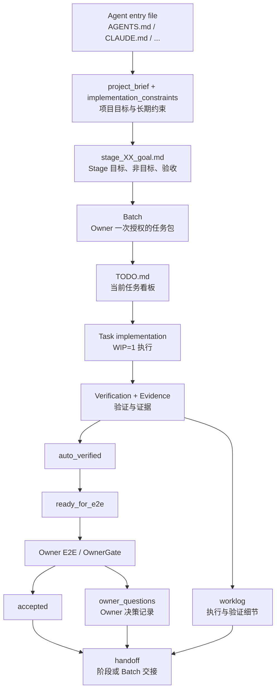

# Docs is all you need for Coding Agents

> 一个 agent-entry-file-first 的 docs-driven development scaffold，面向所有依赖仓库入口文件的
> coding agent。默认入口文件名是 `AGENTS.md`；使用 Claude Code 等其他 agent 时，可按工具约定改为
> `CLAUDE.md` 或其他对应名称。

## 一句话理解

**Docs is all you need for Coding Agents** 不是普通文档集合，也不是某个工具的提示词合集，而是一套给
Owner、Planning AI 和 coding agent 协作使用的 **项目文档操作系统**。

它的目标不是“多写文档”，而是让仓库成为 coding agent 的唯一事实来源：
目标、约束、任务状态、验证证据、Owner 决策都应沉淀到仓库正式文档中。

- Owner 负责发起任务、定边界、批准 Batch、做阶段级或高风险验收。
- Planning AI 负责规划、分析、比较、起草文档和拆分建议。
- Coding agent 负责读取正式文档后实现、验证、维护看板、记录 evidence 和交接。
- Agent entry file 负责告诉 coding agent：应该先读什么、能改什么、什么时候必须停下来问 Owner。

核心执行链路是：

```text
Stage -> Batch -> Task -> Verification -> Evidence -> Worklog -> Handoff
```

## 适合谁

适合：

- 使用 Codex、Claude Code、opencode 或其他 coding agent 辅助开发的人。
- 希望把需求、阶段、缺陷、测试、交接显式化的个人项目或小团队。
- 需要让不同 agent、不同会话、不同执行轮次保持一致边界的项目。
- 想减少“agent 猜错上下文”“阶段范围漂移”“TODO 与验收口径不一致”的项目。

暂时不太适合：

- 完全不想维护正式文档，只想靠聊天推进的工作流。
- 一次性脚本、极小实验，且没有跨会话协作需求的场景。
- 不希望区分规划、执行、验收边界的项目。

## 核心概念

| 概念 | 说明 |
|---|---|
| Repository as System of Record | 长期有效的信息必须进入仓库正式文档；聊天记录不是长期状态源。 |
| Cold Start | 新 Agent 只看仓库，也应该能判断项目目标、当前阶段、当前 Batch、如何验证和哪些事项需要 OwnerGate。 |
| Stage | 阶段目标，定义当前阶段做什么、不做什么、如何验收。 |
| Batch | Owner 一次授权 coding agent 连续推进的一组任务，解决“阶段太大、任务太碎”的问题。 |
| Task | 具体执行项，必须有 behavior / expected outcome、verification 和 evidence。 |
| OwnerGate | 必须停下来问 Owner 的决策点，不是普通测试状态。 |
| Worklog | 保存详细执行记录、验证命令、失败尝试和 evidence，避免 TODO 膨胀。 |
| Owner Questions | 保存未决 Owner 决策、授权、澄清或验收问题，避免散落在 TODO 或聊天里。 |
| Handoff | 保存阶段或 Batch 交接摘要，帮助下一轮 Agent 接手。 |

## 核心文档分层

| 文档 | 作用 | 是否直接驱动执行 | Agent 权限 |
|---|---|---|---|
| Agent entry file | Coding agent 轻量入口和索引，例如 `AGENTS.md` / `CLAUDE.md` | 间接驱动 | 询问后可改 |
| `TODO.md` | 当前任务看板，不保存长篇日志 | 是 | 自动可改 |
| `docs/project/project_brief.md` | 项目目标、范围、非目标 | 否 | 只读 |
| `docs/project/implementation_constraints.md` | 技术、依赖、架构、部署、安全约束 | 是 | 只读 |
| 模块目录下的 `ARCHITECTURE.md` / `CONSTRAINTS.md` / `README.md` | 靠近代码的模块职责、接口和特殊约束 | 是，限相关模块 | 随模块规则而定 |
| `docs/stages/stage_XX_goal.md` | 阶段目标、非目标、阶段级验收 | 是 | 询问后可改 |
| `docs/templates/batch_template.md` | Batch 授权范围模板；复制为 active instance 后驱动执行 | 模板否，实例是 | 模板询问后可改；实例按授权维护 |
| `docs/templates/task_board_template.md` | Task 完整字段模板；TODO 只保留摘要 | 模板否，实例是 | 模板询问后可改；实例自动可改 |
| `docs/templates/worklog_template.md` | 执行细节、验证记录、历史任务记录模板 | 间接驱动 | 模板询问后可改；实例自动可改 |
| `docs/templates/owner_questions_template.md` | Owner 决策问题模板 | 间接驱动 | 模板询问后可改；实例自动记录，Owner 回答 |
| `docs/testing/test_strategy.md` | 自动验证、手动验收分工 | 间接驱动 | 询问后可改 |
| `docs/testing/manual_test_template.md` | Owner E2E / 阶段级 / 高风险验收模板 | 间接驱动 | 自动可改 |
| `docs/handoffs/stage_summary_template.md` | 阶段或 Batch 交接模板 | 否 | 询问后可改 |
| `docs/changes/REQ_*.md` | 新增需求输入 | 否，需 Owner 决定是否并入 | 只读 |
| `docs/bugs/open/BUG_*.md` | 缺陷输入与修复验收依据 | 否，需 Owner 明确触发修复 | 只读 |
| `docs/reports/**` | 分析、对比、调查、总结 | 默认否 | 询问后可改 |

### Template Files 与 Active Instance Files

`docs/templates/**` 统一存放通用模板文件。模板文件只提供结构和占位示例，不代表当前项目事实，
也不直接驱动执行。

实际项目使用时，把模板复制到对应 stage / batch / handoff 目录或项目约定位置，形成
active instance files。Coding agent 执行时读取和维护 active instance，而不是把模板当作当前状态。

## 文档如何驱动执行



关键理解：

1. Agent entry file 是入口和索引，不是巨型知识库；默认可用 `AGENTS.md`，也可按 agent 改名。
2. `stage_XX_goal.md` 定义阶段边界，Batch 定义本次授权范围。
3. `TODO.md` 是当前看板，不是执行日志。
4. Task 必须有 verification 和 evidence，才可进入 `auto_verified`。
5. 多个 `auto_verified` 任务形成用户路径后，进入 `ready_for_e2e`。
6. Owner 只需要重点验收 E2E、阶段级、高风险、真实外部调用、架构 / contract 决策。
7. 详细过程进入 worklog，未决决策进入 owner_questions，交接摘要进入 handoff。

## 推荐目录骨架

实际仓库内已提供模板文件；下面的 `docs/stages/stage_XX/...` 是推荐实例化结构，使用时可按项目约定创建。

```text
.
├── AGENTS.md                 # 默认 agent entry file；可按 agent 改为 CLAUDE.md 等
├── README.md
├── TODO.md
├── src/
│   ├── api/
│   │   ├── ARCHITECTURE.md          # 可选：API 层职责、接口和认证约束
│   │   └── ...
│   ├── db/
│   │   ├── CONSTRAINTS.md           # 可选：数据库操作硬约束
│   │   └── ...
│   └── ...
└── docs/
    ├── meta/
    │   ├── docs_framework_overview.md
    │   ├── collaboration_workflow_guide.md
    │   ├── agent_execution_workflows.md
    │   ├── agent_doc_permissions.md
    │   ├── agent_code_style_guide.md
    │   └── agent_reporting_guide.md
    ├── project/
    │   ├── project_brief.md
    │   ├── implementation_constraints.md
    │   ├── architecture_overview.md
    │   └── file_index.md
    ├── stages/
    │   ├── stage_XX_goal.md
    │   └── stage_XX/                  # 推荐实例化结构
    │       ├── batches/
    │       │   └── B-XX-YY.md
    │       ├── task_board.md
    │       ├── worklog.md
    │       └── owner_questions.md
    ├── changes/
    │   └── REQ_template.md
    ├── bugs/
    │   ├── open/
    │   │   └── BUG_template.md
    │   └── closed/
    ├── testing/
    │   ├── test_strategy.md
    │   └── manual_test_template.md
    ├── handoffs/
    │   └── stage_summary_template.md
    ├── templates/
    │   ├── batch_template.md
    │   ├── task_board_template.md
    │   ├── worklog_template.md
    │   ├── owner_questions_template.md
    │   ├── cold_start_check_template.md
    │   └── clean_state_check_template.md
    ├── TODO_backup/
    └── reports/
        ├── analysis/
        ├── comparison/
        ├── survey/
        └── summary/
```

说明：

- Agent entry file 是入口：项目概览、运行命令、验证方式、全局硬约束和索引。
- `docs/**` 保存项目级、阶段级、任务级、验证和交接文档。
- 模块目录下的 `ARCHITECTURE.md` / `CONSTRAINTS.md` / `README.md` 保存靠近代码的模块级知识；只有当这些规则会影响 Agent 决策时才需要创建。

## 10 分钟快速上手

### Step 1：复制脚手架

把本仓库内容复制到目标项目根目录。

### Step 2：补齐项目三件套

优先补齐：

1. `docs/project/project_brief.md`
2. `docs/project/implementation_constraints.md`
3. `docs/stages/stage_01_goal.md`

### Step 3：做 Cold Start Check

让 Agent 检查是否能只看仓库接手：

```text
请读取你的 agent entry file、TODO.md、docs/project/project_brief.md、
docs/project/implementation_constraints.md、docs/stages/stage_01_goal.md，
做一次 Cold Start Check，并指出缺失信息应补到哪个文档。
```

### Step 4：拆第一个 Batch

Owner 或 Planning AI 从 Stage 中拆出一个小 Batch。可从
`docs/templates/batch_template.md` 复制为实际 Batch 文档。

### Step 5：Owner 批准 Batch

Batch 里写清楚：

- 允许 coding agent 自动做什么。
- 不允许 coding agent 自动做什么。
- 自动验收标准是什么。
- 哪些情况触发 OwnerGate。

### Step 6：Coding agent 在 Batch 内执行

Coding agent 在 Batch 内遵守：

- WIP=1。
- 自动验证。
- 记录 evidence。
- 更新 TODO 当前看板。
- 记录 worklog。
- 触发 OwnerGate 就暂停。

### Step 7：进入 ready_for_e2e

多个 `auto_verified` 任务组成完整用户路径后，让 Owner 做 E2E、阶段级或高风险验收。
Owner 不需要逐项手测每个小 Task。

### Step 8：handoff / clean state

阶段或 Batch 收尾时：

- 更新 handoff。
- 同步 worklog 和 owner_questions。
- 说明 verification / evidence。
- 做 clean state check。

## Recommended Agent Workflow

1. Owner 确认 Stage。
2. Planning AI 或 Owner 拆 Batch。
3. Owner 批准 Batch。
4. Coding agent 读取 agent entry file 和相关正式文档。
5. Coding agent 做 Cold Start Check。
6. Coding agent 在 Batch 内遵守 WIP=1 连续实现。
7. 每个 Task 通过 verification 后记录 evidence。
8. Task 进入 `auto_verified`。
9. 多个 `auto_verified` 任务形成 `ready_for_e2e`。
10. 触发 OwnerGate 时暂停并提问。
11. Owner 只验收 E2E、阶段级、高风险、真实外部调用、架构 / contract 决策。
12. Coding agent 更新 TODO、worklog、owner_questions、handoff。
13. 最后执行 clean state check。

## 面向 Coding Agent 的核心约束

Coding agent 应始终遵守：

- 不因看到某个 REQ 或 BUG 就自动开工。
- 不静默修改只读文档。
- 不替 Owner 决定阶段边界和验收结论。
- 不把报告结论直接当作执行指令。
- 不把 TODO 当执行日志。
- 不把旧状态作为新任务默认状态。
- 不在没有 verification / evidence 前标记 `auto_verified`。
- 不在没有 Owner 明确验收前标记 `accepted`。
- 不越过 OwnerGate。
- 不同时推进多个 `doing` 任务。
- 不把聊天里的长期规则留在聊天里。
- 不在没有明确触发时提交 commit、删除文件、发布版本或移动归档。

## 最小可用集合

### 最小版

```text
AGENTS.md  # 或按 agent 改为 CLAUDE.md 等
TODO.md
docs/project/project_brief.md
docs/project/implementation_constraints.md
docs/stages/stage_01_goal.md
docs/testing/test_strategy.md
```

### 推荐版

以下 `stage_01`、`B-01-01`、`stage_01_summary.md` 仅作为示例占位，不代表真实业务项目、
真实阶段内容或真实任务内容。使用时可从 `docs/templates/**` 复制模板到项目约定位置。

```text
AGENTS.md  # 或按 agent 改为 CLAUDE.md 等
TODO.md
docs/project/project_brief.md
docs/project/implementation_constraints.md
docs/stages/stage_01_goal.md
docs/stages/stage_01/batches/B-01-01.md
docs/stages/stage_01/task_board.md
docs/stages/stage_01/worklog.md
docs/stages/stage_01/owner_questions.md
docs/testing/test_strategy.md
docs/handoffs/stage_01_summary.md
```

之后再按需要补充 REQ、BUG、report、更多 Batch 和阶段交接材料。
