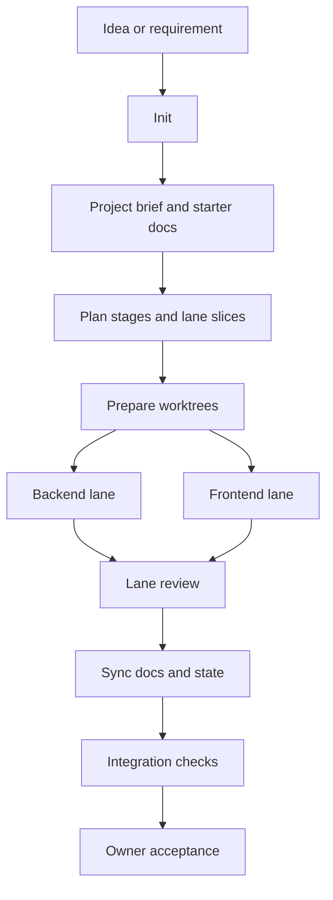
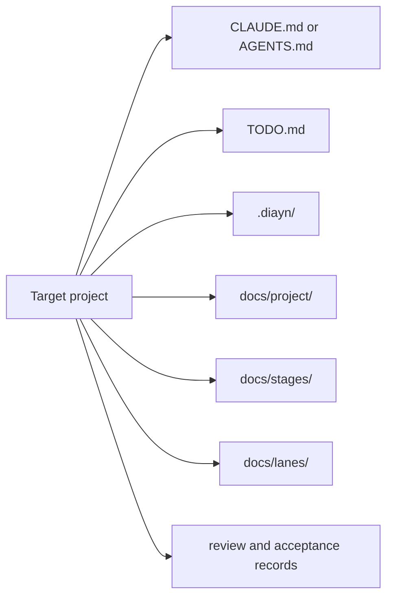

# Docs-is-all-you-need

[中文](README.zh-CN.md)

DIAYN is a document-driven workflow pack for multi-session coding agents. It
turns a vague idea or requirement into a staged project with planning, lane
execution, review, synchronization, integration, and Owner acceptance.

DIAYN is not an application framework. It is a skill/plugin package that helps
coding agents keep requirements, work state, evidence, and acceptance records
close to the project they are changing.

## Status

| Platform | Status | Main user entry |
| --- | --- | --- |
| Claude Code plugin | Supported | `/diayn:init`, `/diayn:plan`, `/diayn:backend`, etc. |
| Codex Desktop plugin | Supported | Codex skills such as `$diayn-init`, `$diayn-plan`, `$diayn-backend` |
| Claude project-local fallback | Supported fallback | bare `/diayn-init`, `/diayn-plan`, `/diayn-backend` |
| Codex project-local package | Supported fallback | project-local Codex skills such as `$diayn-init` |
| OpenCode | TODO | not claimed yet |

DIAYN also bundles a locked set of DIAYN-managed dependency skills from
`agent-skills`. Users do not need to install `agent-skills` separately for the
supported DIAYN install paths.

## Who It Is For

- Owners who want a raw idea turned into a clear implementation plan.
- Teams using multiple coding-agent sessions for backend, frontend, review,
  integration, and acceptance.
- Claude Code users who want a plugin-first `/diayn:*` workflow.
- Codex users who want DIAYN available as installable Codex skills.

## Quick Start

### Claude Code Plugin

Copy these commands into Claude Code:

```text
/plugin marketplace add ice268528/Docs-is-all-you-need
/plugin install diayn@diayn
/diayn:init
```

Claude Code plugin mode uses namespaced commands such as `/diayn:init` and
`/diayn:plan`.

### Codex Desktop Plugin

Open Codex Desktop, choose "Add plugin marketplace", and fill the fields like
this:

```text
Source: git@github.com:ice268528/Docs-is-all-you-need.git
Git ref: main
Sparse path:
.agents/plugins
plugins/diayn
```

Put both sparse paths in the same "Sparse path" field, one per line. The first
path provides the marketplace manifest, and the second path provides the DIAYN
plugin payload.

After installing the DIAYN plugin, start in a target project with:

```text
$diayn-init initialize this project with DIAYN
```

Then continue with `$diayn-plan`, `$diayn-worktrees`, `$diayn-backend`,
`$diayn-frontend`, `$diayn-review-backend`, `$diayn-review-frontend`,
`$diayn-sync`, and `$diayn-integration` as the workflow progresses.

## Core Workflow



Review can send work back to the responsible lane when evidence, tests,
contracts, or acceptance criteria are not good enough.

## Command Reference

| Workflow | Claude plugin | Codex plugin | Project-local fallback |
| --- | --- | --- | --- |
| Init / retrofit | `/diayn:init` | `$diayn-init` | `/diayn-init` or `$diayn-init` |
| Plan | `/diayn:plan` | `$diayn-plan` | `/diayn-plan` or `$diayn-plan` |
| Worktrees | `/diayn:worktrees` | `$diayn-worktrees` | `/diayn-worktrees` or `$diayn-worktrees` |
| Backend lane | `/diayn:backend` | `$diayn-backend` | `/diayn-backend` or `$diayn-backend` |
| Frontend lane | `/diayn:frontend` | `$diayn-frontend` | `/diayn-frontend` or `$diayn-frontend` |
| Backend review | `/diayn:review-backend` | `$diayn-review-backend` | `/diayn-review-backend` or `$diayn-review-backend` |
| Frontend review | `/diayn:review-frontend` | `$diayn-review-frontend` | `/diayn-review-frontend` or `$diayn-review-frontend` |
| Sync docs/state | `/diayn:sync` | `$diayn-sync` | `/diayn-sync` or `$diayn-sync` |
| Integration | `/diayn:integration` | `$diayn-integration` | `/diayn-integration` or `$diayn-integration` |
| Bug triage | `/diayn:bug` | `$diayn-bug` | `/diayn-bug` or `$diayn-bug` |
| New stage/change | `/diayn:new` | `$diayn-new` | `/diayn-new` or `$diayn-new` |
| HTML report | `/diayn:html` | `$diayn-html` | `/diayn-html` or `$diayn-html` |

The fallback column is only for project-local package installs. In Claude Code
plugin mode, use `/diayn:*`. In Codex Desktop plugin mode, use the DIAYN skills
that Codex installs from the plugin.

## What DIAYN Adds To A Target Project



Typical generated or maintained files include:

- a platform entry file: `CLAUDE.md` for Claude Code, or `AGENTS.md` for Codex,
  OpenCode, and generic agents;
- `TODO.md` for the current project summary;
- `.diayn/` for DIAYN control files and metadata;
- `docs/project/` for the project brief, file index, and harness audit;
- `docs/stages/` for stage plans, integration summaries, closeout, and Owner
  acceptance records;
- `docs/lanes/` for backend/frontend lane boards, handoffs, evidence, and
  review logs.

These files are generated in the target project where DIAYN runs. They are not
all expected to exist in this source repository.

## Public Repository Shape

| Path | Purpose |
| --- | --- |
| `.claude-plugin/` and `.claude/commands/` | Claude Code plugin manifest and `/diayn:*` command adapters |
| `.agents/plugins/` and `plugins/diayn/` | Codex Desktop marketplace manifest and plugin payload |
| `skills/` | Authoritative 12 DIAYN workflow skills |
| `packages/claude-project-local/` | Claude project-local fallback package |
| `packages/codex-project-local/` | Codex project-local fallback package |
| `docs/install/` | Install guides |
| `docs/meta/` and `docs/templates/` | Durable workflow protocol and templates |

Maintainer-only source snapshots, validation evidence, adapter experiments, and
old candidate payloads are intentionally excluded from the public remote
surface. If they exist on a maintainer machine, they live under the ignored
`docs/local-maintainer/` directory. This does not remove runtime dependency
skills from DIAYN installs; packaged dependency skills remain in the plugin and
fallback package payloads.

## Reference Projects

DIAYN's skill packaging and cross-agent installation surface were informed by
these projects:

- [addyosmani/agent-skills](https://github.com/addyosmani/agent-skills)
- [obra/superpowers](https://github.com/obra/superpowers)

## More Docs

- [Install overview](docs/install/README.md)
- [Claude Code install](docs/install/claude-code.md)
- [Codex Desktop plugin install](docs/install/codex_plugin.md)
- [Codex project-local skills package](docs/install/codex_skills.md)
- [OpenCode status](docs/install/opencode.md)
- [DIAYN command reference](docs/meta/diayn_command_reference.md)
- [Project file index](docs/project/file_index.md)
