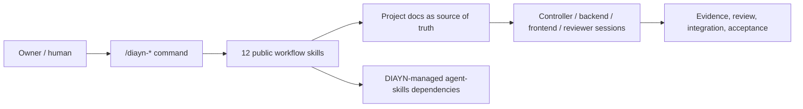
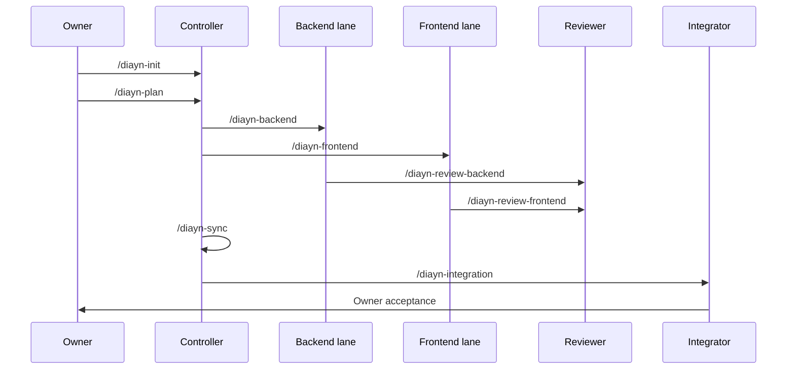

# Docs-is-all-you-need

[Chinese](README.zh-CN.md)

Docs-is-all-you-need, or DIAYN, is a document-driven multi-session coding-agent
collaboration control plane delivered as an installable skill pack.

DIAYN V1 exposes exactly 12 public `/diayn-*` workflow skills. Internal roles
such as Controller, Executor, Reviewer, Integrator, Identity Guard, Owner UX,
and Skill Router are implementation references, not extra public commands.



## Install

### Claude Code CLI

Claude Code should follow the same plugin-first installation model used by
`superpowers` and `agent-skills`.

The repository now includes a root Claude plugin entrypoint:

```text
.claude-plugin/plugin.json
.claude-plugin/marketplace.json
```

The root manifest points to DIAYN command adapters under `.claude/commands`
and to the platform-visible Claude package skills under
`packages/claude-project-local/.claude/skills`.
That skills root contains the 12 DIAYN workflow skills plus the 23 locked
DIAYN-managed `agent-skills` dependency skills.

Once DIAYN has a published Claude marketplace entry, the intended user install
shape is:

```text
/plugin marketplace add <diayn-marketplace-or-repo>
/plugin install docs-is-all-you-need@<marketplace-name>
```

For local development before publication, run Claude Code with the plugin
candidate:

```powershell
claude --plugin-dir E:\Allproject\VscodeProject\docs_is_all_you_need_for_AGENTS\Docs-is-all-you-need
```

The older inner candidate remains available for focused local plugin-dir
tests:

```powershell
claude --plugin-dir E:\Allproject\VscodeProject\docs_is_all_you_need_for_AGENTS\Docs-is-all-you-need\plugins\docs-is-all-you-need
```

The Claude plugin candidate has:

```text
 .claude-plugin/plugin.json
 .claude-plugin/marketplace.json
.claude/commands/diayn-*.md
plugins/docs-is-all-you-need/.claude-plugin/plugin.json
plugins/docs-is-all-you-need/.claude/commands/diayn-*.md
plugins/docs-is-all-you-need/skills/diayn-*/
plugins/docs-is-all-you-need/dependency-skills/
```

Start with:

```text
/diayn-init
```

Current boundary: the local `--plugin-dir` validation path has observed
namespaced plugin commands, while the DDDV8 user-facing requirement is bare
`/diayn-*`. The `packages/claude-project-local/` copy package is therefore kept
as an alpha fallback and validation fixture for bare `/diayn-*`; it is not the
normative final installation model.

### Codex Desktop

The repository now includes a root Codex plugin entrypoint:

```text
.codex-plugin/plugin.json
```

It points to `packages/codex-project-local/.codex/skills/`, which contains the
12 DIAYN workflow skills plus the 23 DIAYN-managed dependency skills. The older
inner Codex plugin candidate remains under `plugins/docs-is-all-you-need/` for
local packaging experiments. The 12 public DIAYN skills in the generated Codex
package also include Codex-specific `agents/openai.yaml` metadata.

Codex package/install validation is complete for the current Owner-approved
scope. Validation runs the install command and inspects the installed directory
shape; it does not launch Codex Desktop and does not claim app-session runtime
discovery. To install the Codex Home skill package from this repository, run
these commands from the repository root. Start with a dry-run:

```powershell
node maintainers\scripts\install_codex_project_local_package.js --target-codex-home $env:USERPROFILE\.codex
```

If the dry-run looks correct, execute the install:

```powershell
node maintainers\scripts\install_codex_project_local_package.js --target-codex-home $env:USERPROFILE\.codex --execute
```

This installs:

- 12 public DIAYN workflow skills into `$CODEX_HOME/skills`;
- 23 DIAYN-managed `agent-skills` dependency skills;
- DIAYN metadata into `$CODEX_HOME/diayn/docs-is-all-you-need`.

The install command does not delete existing user skills. If old DIAYN test
skills are present, clean them intentionally before reinstalling.

After installation, a manual Codex Desktop trial can start in the target project
with:

```text
/diayn-init
```

The current release claim is `codex_package_install`: package shape, install
command, and directory inspection are validated. Codex Desktop app-session
direct `/diayn-*` invocation and native dependency-skill invocation were not
attempted by Owner instruction and must not be claimed.

### Dependency Skill Routing

DIAYN carries 23 locked third-party `agent-skills` as managed dependency
skills. They are not extra public DIAYN commands. A `/diayn-*` workflow owns the
role, lane, state, review, integration, evidence, and Owner boundary first;
then the DIAYN router selects the smallest relevant dependency skill set.

Dependency skill ids are resolved per surface. Project-local installs use names
such as `idea-refine`; Claude plugin namespace installs may require
`docs-is-all-you-need:idea-refine`; Codex uses the skill id discovered from the
installed skills root.

The routing map is:

```text
skills/diayn-skill-router/references/upstream-routing-map.md
```

Current evidence proves a representative native routed dependency call on
Claude Code project-local: `/diayn-init` routed a vague idea workflow to the
DIAYN-managed `idea-refine` skill through the native `Skill` tool. The package
contains all 23 dependency skills and a routing rationale for each one, but it
does not claim every dependency skill has been exhaustively exercised in a live
workflow.

The Claude skill-creator alignment record is:

```text
validation/phase9_claude_skill_creator_alignment.json
```

It prepares per-skill trigger eval seeds and keeps the boundary that no
with-skill vs baseline benchmark has been committed yet.

## Public Commands

```text
/diayn-init
/diayn-plan
/diayn-worktrees
/diayn-backend
/diayn-frontend
/diayn-review-backend
/diayn-review-frontend
/diayn-sync
/diayn-integration
/diayn-bug
/diayn-new
/diayn-html
```



## What Is In This Repository

| Path | Purpose |
| --- | --- |
| `skills/` | DIAYN source workspace. It includes public workflow source plus internal/historical source. It is not the install surface. |
| `plugins/docs-is-all-you-need/` | Claude/Codex plugin candidate with exactly 12 public DIAYN workflow skills. |
| `packages/codex-project-local/` | Codex project-local/Home install package and fixture path. |
| `packages/claude-project-local/` | Claude Code bare-command alpha fallback and installed-flow fixture. |
| `plugins/docs-is-all-you-need/dependency-skills/` | Locked DIAYN-managed third-party `agent-skills` payload. |
| `validation/` | Committed fixture evidence and release-gate outputs. Codex package/install evidence is committed; app-session runtime evidence is optional future evidence. |

## Current Support Status

| Surface | Status |
| --- | --- |
| Claude Code plugin candidate | Standard install target; local plugin-dir validates plugin shape but bare `/diayn-*` still needs marketplace/runtime proof. |
| Claude Code project-local fallback | Proven alpha fixture for bare `/diayn-*` installed flow; not the final install model. |
| Codex package/install | Validated alpha surface: package shape, install command, and directory inspection pass. Desktop app-session runtime is not attempted and not claimed. |
| OpenCode | Deferred until direct `/diayn-*` skill invocation is proven. |

Do not treat shell-launched Codex or install-fixture output as Codex Desktop
app-session runtime proof. The current validation boundary intentionally stops
before Desktop launch.

## Read Next

| Need | Read |
| --- | --- |
| Install/support truth | `docs/install/README.md` |
| Implementation phases | `docs/meta/diayn_v1_implementation_plan.md` |
| Completion audit | `docs/meta/diayn_v1_completion_audit.md` |
| Command behavior | `docs/meta/diayn_command_reference.md` |
| Root `skills/` explanation | `skills/README.md` |

Keep durable facts in repository documents. Keep chat for immediate
coordination, clarification, and user feedback.
