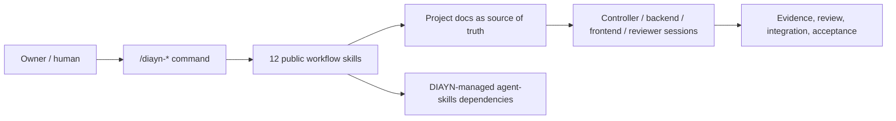
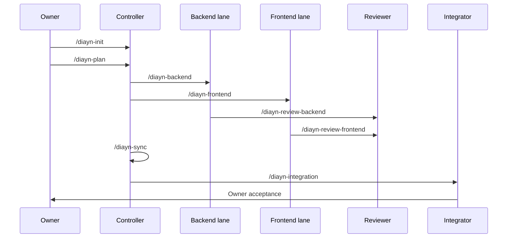

# Docs-is-all-you-need

[Chinese](README.zh-CN.md)

Docs-is-all-you-need, or DIAYN, is a document-driven multi-session coding-agent
collaboration control plane delivered as an installable skill pack.

DIAYN V1 exposes exactly 12 public `/diayn-*` workflow skills. Internal roles
such as Controller, Executor, Reviewer, Integrator, Identity Guard, Owner UX,
and Skill Router are implementation references, not extra public commands.
In Claude plugin mode, those workflows are expected to be invoked through
namespaced commands such as `/diayn:diayn-init`; bare `/diayn-*` belongs to the
project-local fallback path.



## Install

### Claude Code CLI

DIAYN supports two separate Claude Code paths. Do not mix their evidence:

1. **Standard Claude Code plugin / marketplace path** uses plugin-namespaced
   commands.
2. **Project-local fallback path** installs files into a target project's
   `.claude/` directory and provides bare `/diayn-*` short commands.

#### Standard Plugin / Marketplace Path

The repository includes a root Claude plugin entrypoint:

```text
.claude-plugin/plugin.json
.claude-plugin/marketplace.json
```

The root manifest uses `name: "diayn"`, so the plugin namespace is expected to
be `diayn`. It points to thin command adapters under `.claude/commands` and to
platform-visible Claude skills under `packages/claude-project-local/.claude/skills`.
That skills root contains the 12 DIAYN workflow skills plus 23 locked
DIAYN-managed `agent-skills` dependency skills.

DIAYN is not claiming Anthropic official marketplace listing. For GitHub
marketplace-style installation, the intended shape is:

```text
/plugin marketplace add ice268528/Docs-is-all-you-need
/plugin install diayn@<marketplace-name>
```

For local development before publication, run Claude Code with the plugin
candidate:

```powershell
claude --plugin-dir <path-to-this-repo>
```

Expected plugin command format:

```text
/diayn:diayn-init
/diayn:diayn-plan
/diayn:diayn-backend
```

Optional aliases such as `/diayn:init` are not implemented in this release.
They would require command alias wrappers plus runtime proof. Plugin mode does
not promise bare `/diayn-*` commands unless a future Claude Code runtime test
proves that behavior.

The older inner candidate remains available for focused local plugin-dir tests:

```powershell
claude --plugin-dir <path-to-this-repo>\plugins\docs-is-all-you-need
```

The Claude plugin candidate has:

```text
 .claude-plugin/plugin.json
 .claude-plugin/marketplace.json
.claude/commands/diayn-*.md
plugins/docs-is-all-you-need/.claude-plugin/plugin.json
plugins/docs-is-all-you-need/.claude/commands/diayn-*.md
plugins/docs-is-all-you-need/skills/diayn-*/
plugins/docs-is-all-you-need/dependency-skills/
```

#### Project-Local Fallback Path

Use the fallback when you specifically want bare `/diayn-*` short commands in a
target project. This path writes DIAYN files into that target project's
`.claude/` and `.diayn/` directories:

```text
.claude/commands/diayn-*.md
.claude/skills/diayn-*/
.claude/skills/<agent-skills-name>/
.diayn/dependency-routing/upstream-routing-map.md
.diayn/internal-role-skills/
.diayn/dependency-skills-manifest.json
```

The fallback package source is:

```text
packages/claude-project-local/
```

After project-local installation, start with:

```text
/diayn-init
```

This is local short-command installation. It is not evidence that the plugin /
marketplace path supports bare `/diayn-*`.

### Codex Desktop

The repository now includes a root Codex plugin entrypoint:

```text
.codex-plugin/plugin.json
```

It points to `packages/codex-project-local/.codex/skills/`, which contains the
12 DIAYN workflow skills plus the 23 DIAYN-managed dependency skills. The older
inner Codex plugin candidate remains under `plugins/docs-is-all-you-need/` for
local packaging experiments. The 12 public DIAYN skills in the generated Codex
package also include Codex-specific `agents/openai.yaml` metadata.

Codex package/install validation runs the install command and inspects the
installed directory shape. It does not launch Codex Desktop and does not claim
app-session runtime discovery. To install the Codex Home skill package from
this repository, run these commands from the repository root. Start with a
dry-run:

```powershell
node maintainers\scripts\install_codex_project_local_package.js --target-codex-home $env:USERPROFILE\.codex
```

If the dry-run looks correct, execute the install:

```powershell
node maintainers\scripts\install_codex_project_local_package.js --target-codex-home $env:USERPROFILE\.codex --execute
```

This installs:

- 12 public DIAYN workflow skills into `$CODEX_HOME/skills`;
- 23 DIAYN-managed `agent-skills` dependency skills;
- DIAYN metadata into `$CODEX_HOME/diayn/docs-is-all-you-need`.

The install command does not delete existing user skills. If old DIAYN test
skills are present, clean them intentionally before reinstalling.

After installation, a manual Codex Desktop trial can start in the target project
with:

```text
/diayn-init
```

The current release claim is `codex_package_install`: package shape, install
command, and directory inspection are validated. Codex Desktop app-session
direct `/diayn-*` invocation and native dependency-skill invocation require
separate runtime evidence before they can be claimed.

### Dependency Skill Routing

DIAYN carries 23 locked third-party `agent-skills` as managed dependency
skills. They are not extra public DIAYN commands. A `/diayn-*` workflow owns the
role, lane, state, review, integration, evidence, and Owner boundary first;
then the DIAYN router selects the smallest relevant dependency skill set.

Dependency skill ids are resolved per surface. Project-local installs use names
such as `idea-refine`; Claude plugin namespace installs may require
`diayn:idea-refine`; Codex uses the skill id discovered from the installed
skills root.

The routing map is:

```text
maintainers/internal-skills/diayn-skill-router/references/upstream-routing-map.md
```

Current evidence proves a representative native routed dependency call on
Claude Code project-local: `/diayn-init` routed a vague idea workflow to the
DIAYN-managed `idea-refine` skill through the native `Skill` tool. The package
contains all 23 dependency skills and a routing rationale for each one, but it
does not claim every dependency skill has been exhaustively exercised in a live
workflow.

The Claude skill-authoring authority used for local maintainer alignment is
Anthropic's official skills repository:

```text
git@github.com:anthropics/skills.git
```

It prepares per-skill trigger eval seeds and keeps the boundary that no
with-skill vs baseline benchmark has been committed yet.

## Public Commands

```text
/diayn-init
/diayn-plan
/diayn-worktrees
/diayn-backend
/diayn-frontend
/diayn-review-backend
/diayn-review-frontend
/diayn-sync
/diayn-integration
/diayn-bug
/diayn-new
/diayn-html
```



## What Is In This Repository

| Path | Purpose |
| --- | --- |
| `skills/` | Public DIAYN workflow source. It contains exactly 12 public `/diayn-*` skills. |
| `maintainers/internal-skills/` | Maintainer-only internal role/router/scaffold source used by package builders. It is not installable public skill surface. |
| `plugins/docs-is-all-you-need/` | Claude/Codex plugin candidate with exactly 12 public DIAYN workflow skills. |
| `packages/codex-project-local/` | Codex project-local/Home install package. |
| `packages/claude-project-local/` | Claude Code bare-command development and validation package. |
| `plugins/docs-is-all-you-need/dependency-skills/` | Locked DIAYN-managed third-party `agent-skills` payload. |

Maintainer validation outputs are local-only under `validation/` and are ignored
by Git. They are useful for implementation and release checks, but they are not
uploaded as repository content because ordinary users do not need them.

## Current Support Status

| Surface | Status |
| --- | --- |
| Claude Code plugin candidate | Standard install target; static plugin shape validates. Expected command shape is `/diayn:diayn-*`; runtime visibility still needs Owner verification. |
| Claude Code project-local package | Proven development package for bare `/diayn-*` installed flow; not the final marketplace install model. |
| Codex package/install | Validated package surface: package shape, install command, and directory inspection pass. Desktop app-session runtime requires separate evidence. |
| OpenCode | Deferred until direct `/diayn-*` skill invocation is proven. |

Do not treat shell-launched Codex or install-output inspection as Codex Desktop
app-session runtime proof.

## Read Next

| Need | Read |
| --- | --- |
| Install/support truth | `docs/install/README.md` |
| Implementation phases | `docs/meta/diayn_v1_implementation_plan.md` |
| Completion audit | `docs/meta/diayn_v1_completion_audit.md` |
| Command behavior | `docs/meta/diayn_command_reference.md` |
| Public `skills/` explanation | `skills/README.md` |
| Internal source explanation | `maintainers/internal-skills/README.md` |

Keep durable facts in repository documents. Keep chat for immediate
coordination, clarification, and user feedback.
