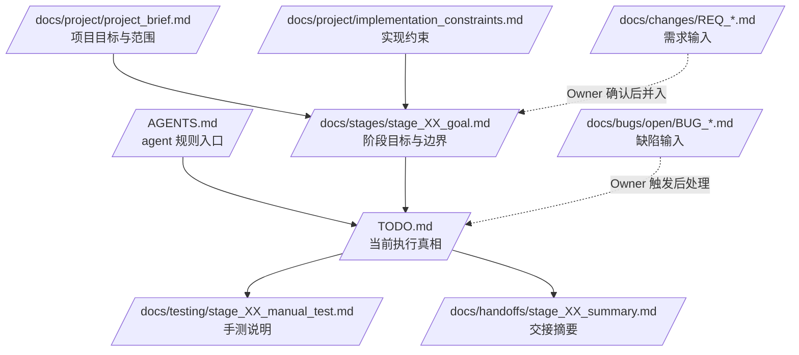

# Docs is all you need for AGENTS

> 一个面向 Codex、opencode 等 **依赖 `AGENTS.md` 的 code agent** 的文档驱动开发脚手架。
> 用正式文档定义边界，用 `TODO.md` 驱动执行，用 `AGENTS.md` 约束 agent 行为。

## 一句话理解

**Docs is all you need for AGENTS** 不是应用框架，也不是某个工具的提示词合集，而是一套给
Owner、Planning AI 和 Code Agent 共同使用的 **项目文档操作系统**。

- Owner 负责发起任务、定边界、做验收。
- Planning AI 负责规划、分析、比较、起草文档。
- Code Agent 负责读取正式文档后实现、测试、维护 TODO 和交接。
- `AGENTS.md` 负责告诉 Codex、opencode 等 agent：应该先读什么、能改什么、不能擅自做什么、完成后如何验证和汇报。

核心目标是：

> **让 agent 的执行依据稳定沉淀在仓库内正式文档中。**

## 适合谁

适合：

- 使用 Codex、opencode 或其他读取 `AGENTS.md` 的 code agent 辅助开发的人。
- 希望把需求、阶段、缺陷、测试、交接显式化的个人项目或小团队。
- 需要让不同 agent、不同会话、不同执行轮次保持一致边界的项目。
- 想减少“agent 猜错上下文”“阶段范围漂移”“TODO 与验收口径不一致”的项目。

暂时不太适合：

- 完全不想维护正式文档，只想靠聊天推进的工作流。
- 一次性脚本、极小实验，且没有跨会话协作需求的场景。
- 不希望区分规划、执行、验收边界的项目。

## 核心文档分层

| 文档 | 作用 | 是否直接驱动执行 | Agent 权限 |
|---|---|---|---|
| `AGENTS.md` | code agent 的项目级规则入口 | 间接驱动 | 询问后可改 |
| `TODO.md` | 当前任务执行真相 | 是 | 自动可改 |
| `docs/project/project_brief.md` | 项目目标、范围、非目标 | 否 | 只读 |
| `docs/project/implementation_constraints.md` | 技术、依赖、架构、部署、安全约束 | 是 | 只读 |
| `docs/stages/stage_XX_goal.md` | 当前阶段范围、交付项、Verify | 是 | 询问后可改 |
| `docs/changes/REQ_*.md` | 新增需求输入 | 否，需 Owner 决定是否并入 | 只读 |
| `docs/bugs/open/BUG_*.md` | 缺陷输入与修复验收依据 | 否，需 Owner 明确触发修复 | 只读 |
| `docs/testing/test_strategy.md` | 测试分工、原则、命令、停止规则 | 间接驱动 | 询问后可改 |
| `docs/testing/stage_XX_manual_test.md` | 给 Owner 的手动测试说明 | 间接驱动 | 自动可改 |
| `docs/handoffs/stage_XX_summary.md` | 阶段交接摘要 | 否 | 询问后可改 |
| `docs/reports/**` | 分析、对比、调查、总结 | 默认否 | 询问后可改 |

## 文档如何驱动执行



关键理解：

1. `AGENTS.md` 定义 agent 怎么工作。
2. `project_brief.md` 定义项目为什么存在、做什么、不做什么。
3. `implementation_constraints.md` 定义长期不能突破的实现边界。
4. `stage_XX_goal.md` 定义当前阶段做什么、如何验收。
5. `TODO.md` 记录当前正在推进的任务、状态、验证结果和待验收项。
6. 报告、REQ、BUG 只有经过 Owner 明确触发或确认后，才进入执行链路。

## 推荐目录骨架

```text
.
├── AGENTS.md
├── README.md
├── TODO.md
└── docs/
    ├── meta/
    │   ├── docs_framework_overview.md
    │   ├── collaboration_workflow_guide.md
    │   ├── agent_execution_workflows.md
    │   ├── agent_doc_permissions.md
    │   ├── agent_code_style_guide.md
    │   └── agent_reporting_guide.md
    ├── project/
    │   ├── project_brief.md
    │   ├── implementation_constraints.md
    │   ├── architecture_overview.md
    │   └── file_index.md
    ├── stages/
    │   └── stage_XX_goal.md
    ├── changes/
    │   └── REQ_template.md
    ├── bugs/
    │   ├── open/
    │   │   └── BUG_template.md
    │   └── closed/
    ├── testing/
    │   ├── test_strategy.md
    │   └── manual_test_template.md
    ├── handoffs/
    │   └── stage_summary_template.md
    ├── TODO_backup/
    └── reports/
        ├── analysis/
        ├── comparison/
        ├── survey/
        └── summary/
```

## 10 分钟快速上手

### Step 1：复制脚手架

把本仓库内容复制到目标项目根目录。

### Step 2：先填 3 份关键文档

优先补齐：

1. `docs/project/project_brief.md`
2. `docs/project/implementation_constraints.md`
3. `docs/stages/stage_01_goal.md`

### Step 3：确认 `AGENTS.md`

根据你的团队习惯调整：

- agent 默认读取顺序。
- 哪些文档自动可改、哪些必须先问。
- 测试命令和最低验证要求。
- 停止汇报格式。
- 是否允许 agent 自动维护 TODO、手测文档和阶段总结。

### Step 4：让 code agent 生成或整理 `TODO.md`

推荐给 agent 的第一条正式执行指令：

```text
请读取 AGENTS.md、docs/stages/stage_01_goal.md、docs/project/implementation_constraints.md 和 TODO.md，
根据当前阶段目标整理 TODO.md，并说明哪些事项需要我确认后才能开始执行。
```

### Step 5：按 TODO 推进

之后让 agent 按 `TODO.md` 执行，每轮完成后回写状态、验证结果和待验收项。

## 面向 code agent 的核心约束

Code Agent 应始终遵守：

- 不因看到某个 REQ 或 BUG 就自动开工。
- 不静默修改只读文档。
- 不替 Owner 决定阶段边界和验收结论。
- 不把报告结论直接当作执行指令。
- 不在未验证前声称完成。
- 不为了“顺手”而做无关重构。
- 不在没有明确触发时提交 commit、删除文件、发布版本或移动归档。

## 最小可用集合

如果只想保留最小文档体系，可以先使用：

```text
AGENTS.md
TODO.md
docs/project/project_brief.md
docs/project/implementation_constraints.md
docs/stages/stage_01_goal.md
docs/testing/test_strategy.md
```

之后再按需要补充 REQ、BUG、handoff、report 等文档。
