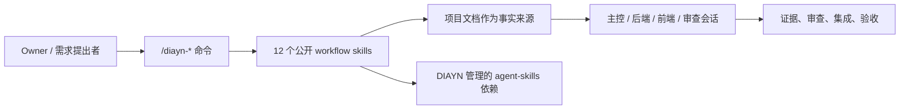
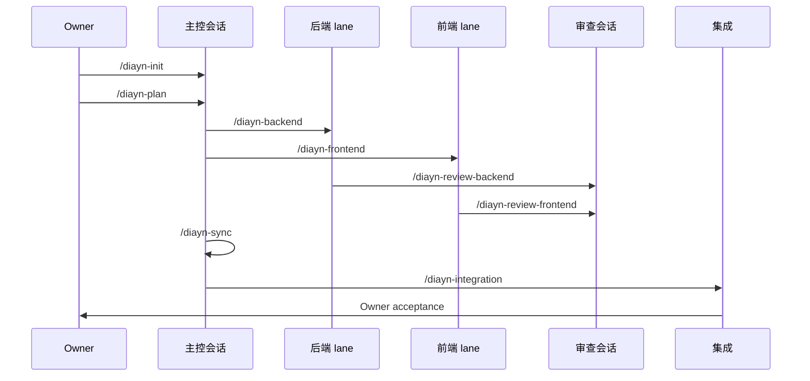

# Docs-is-all-you-need

[English](README.md)

Docs-is-all-you-need，简称 DIAYN，是一个“文档驱动、多会话 coding agent
协作”的控制层，以可安装 skill pack 的形式交付。

DIAYN V1 只暴露 12 条公开 `/diayn-*` workflow skills。Controller、
Executor、Reviewer、Integrator、Identity Guard、Owner UX、Skill Router
这些角色是内部实现参考，不是额外公开命令。



## 安装

### Claude Code CLI

Claude Code 应该采用和 `superpowers`、`agent-skills` 一样的 plugin-first
安装模型。

仓库现在包含根目录 Claude plugin 入口：

```text
.claude-plugin/plugin.json
.claude-plugin/marketplace.json
```

根目录 manifest 会把命令指向
`.claude/commands`，把 skills 指向
`packages/claude-project-local/.claude/skills`。这个 skills root 里有
12 个 DIAYN workflow skills，也有 23 个锁定的、由 DIAYN 管理的
`agent-skills` dependency skills。

DIAYN 发布 Claude marketplace 后，目标用户安装方式应该是：

```text
/plugin marketplace add <diayn-marketplace-or-repo>
/plugin install docs-is-all-you-need@<marketplace-name>
```

发布前的本地开发验证，用 Claude Code 直接加载 plugin candidate：

```powershell
claude --plugin-dir E:\Allproject\VscodeProject\docs_is_all_you_need_for_AGENTS\Docs-is-all-you-need
```

旧的内层候选包仍然保留，用于聚焦的本地 plugin-dir 测试：

```powershell
claude --plugin-dir E:\Allproject\VscodeProject\docs_is_all_you_need_for_AGENTS\Docs-is-all-you-need\plugins\docs-is-all-you-need
```

Claude plugin candidate 的结构是：

```text
.claude-plugin/plugin.json
.claude-plugin/marketplace.json
.claude/commands/diayn-*.md
plugins/docs-is-all-you-need/.claude-plugin/plugin.json
plugins/docs-is-all-you-need/.claude/commands/diayn-*.md
plugins/docs-is-all-you-need/skills/diayn-*/
plugins/docs-is-all-you-need/dependency-skills/
```

从这个命令开始：

```text
/diayn-init
```

当前边界：本地 `--plugin-dir` 验证路径观察到的是 namespaced plugin commands，
但 DDDV8 的用户入口要求是裸 `/diayn-*`。因此
`packages/claude-project-local/` 只保留为裸 `/diayn-*` 的 alpha fallback 和
验证 fixture，不是最终规范安装模型。

### Codex Desktop

仓库现在包含根目录 Codex plugin 入口：

```text
.codex-plugin/plugin.json
```

它指向 `packages/codex-project-local/.codex/skills/`，里面包含 12 个
DIAYN workflow skills 和 23 个 DIAYN 管理的 dependency skills。旧的内层
Codex plugin candidate 仍然保留在 `plugins/docs-is-all-you-need/`，用于本地
打包实验。生成后的 Codex package 里的 12 个公开 DIAYN skills 也包含
Codex 专用的 `agents/openai.yaml` 元数据。

Codex package/install 适配在当前 Owner 批准的验证范围内已经完成。验证方式是
执行安装命令，并检查安装后的目录结构；不会启动 Codex Desktop，也不会声称已经
证明 app-session runtime discovery。安装 Codex Home skill package 时，请在
本仓库根目录执行。先执行 dry-run：

```powershell
node maintainers\scripts\install_codex_project_local_package.js --target-codex-home $env:USERPROFILE\.codex
```

确认 dry-run 输出没有问题后，再执行安装：

```powershell
node maintainers\scripts\install_codex_project_local_package.js --target-codex-home $env:USERPROFILE\.codex --execute
```

这个安装会写入：

- 12 个公开 DIAYN workflow skills 到 `$CODEX_HOME/skills`；
- 23 个 DIAYN 管理的 `agent-skills` 依赖 skills；
- DIAYN 元数据到 `$CODEX_HOME/diayn/docs-is-all-you-need`。

安装命令不会删除已有用户 skills。如果之前装过旧 DIAYN 测试 skills，
请先明确清理，再重新安装。

安装完成后，如果后续要人工试用 Codex Desktop，可以在目标项目里从这个命令开始：

```text
/diayn-init
```

当前 release claim 是 `codex_package_install`：package shape、安装命令和目录
检查已经验证。按 Owner 指示，本轮没有尝试 Codex Desktop app-session 里的
裸 `/diayn-*` 直接调用，也没有尝试原生 dependency-skill 调用，所以不能声称
Codex Desktop app-session runtime 已证明。

### 第三方 Skills 路由

DIAYN 内置并锁定 23 个第三方 `agent-skills`，把它们作为 DIAYN 管理的
dependency skills。它们不是额外的公开 DIAYN 命令。每次 `/diayn-*` workflow
先由 DIAYN 掌握角色、lane、状态、审查、集成、证据和 Owner 边界，然后 router
再选择最小必要的 dependency skill 集合。

dependency skill id 按平台解析。project-local 安装使用 `idea-refine` 这种裸
skill 名；Claude plugin namespace 安装可能需要
`docs-is-all-you-need:idea-refine`；Codex 使用已安装 skills root 中发现的
skill id。

路由表在：

```text
skills/diayn-skill-router/references/upstream-routing-map.md
```

当前证据已经证明 Claude Code project-local 上存在代表性的原生路由调用：
`/diayn-init` 在模糊 idea 场景下，通过 Claude 原生 `Skill` tool 路由调用了
DIAYN 管理的 `idea-refine` skill。安装包包含全部 23 个 dependency skills，
也为每个 skill 写了路由依据；但这不等于 23 个 dependency skills 都已经在真实
workflow 里逐个完整运行过。

Claude skill-creator 对齐记录在：

```text
validation/phase9_claude_skill_creator_alignment.json
```

它准备了每个 workflow skill 的触发评测种子，并明确保留边界：目前还没有提交
with-skill vs baseline benchmark 结果。

## 12 条公开命令

```text
/diayn-init
/diayn-plan
/diayn-worktrees
/diayn-backend
/diayn-frontend
/diayn-review-backend
/diayn-review-frontend
/diayn-sync
/diayn-integration
/diayn-bug
/diayn-new
/diayn-html
```



## 仓库里有什么

| 路径 | 作用 |
| --- | --- |
| `skills/` | DIAYN 源码工作区，包含公开 workflow 源码、内部参考源码和历史源码。它不是安装 surface。 |
| `plugins/docs-is-all-you-need/` | Claude/Codex plugin candidate，只暴露 12 个公开 DIAYN workflow skills。 |
| `packages/codex-project-local/` | Codex project-local/Home 安装包和 fixture 路径。 |
| `packages/claude-project-local/` | Claude Code 裸命令 alpha fallback 和 installed-flow fixture。 |
| `plugins/docs-is-all-you-need/dependency-skills/` | 锁定的、由 DIAYN 管理的第三方 `agent-skills` 依赖。 |
| `validation/` | 已提交的 fixture 证据和 release gate 输出。Codex package/install 证据会提交；app-session runtime 证据是后续可选证据。 |

## 当前支持状态

| 平台 | 状态 |
| --- | --- |
| Claude Code plugin candidate | 标准安装目标；本地 plugin-dir 已验证 plugin shape，但裸 `/diayn-*` 还需要 marketplace/runtime 证明。 |
| Claude Code project-local fallback | 已证明裸 `/diayn-*` alpha fixture；不是最终安装模型。 |
| Codex package/install | 已验证 alpha surface：package shape、安装命令和目录检查通过。Desktop app-session runtime 未尝试，也不声明已证明。 |
| OpenCode | 暂缓，直到能证明可直接触发 `/diayn-*` skills。 |

不要把 shell 启动的 Codex 或安装 fixture 输出当成 Codex Desktop app-session
runtime 证明。当前验证边界明确停在 Desktop 启动之前。

## 继续阅读

| 需求 | 文件 |
| --- | --- |
| 安装和支持状态 | `docs/install/README.md` |
| 实现阶段 | `docs/meta/diayn_v1_implementation_plan.md` |
| 完成度审计 | `docs/meta/diayn_v1_completion_audit.md` |
| 命令行为 | `docs/meta/diayn_command_reference.md` |
| 根目录 `skills/` 为什么有额外目录 | `skills/README.md` |

长期事实写进仓库文档；聊天只用于即时协作、澄清和反馈。
