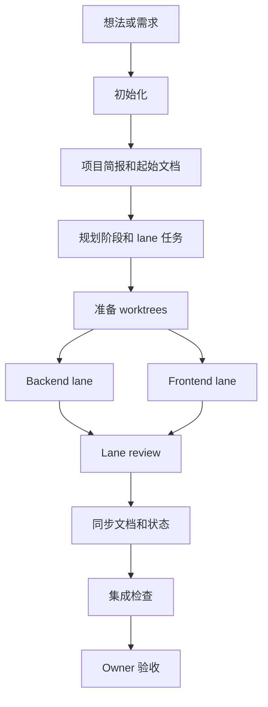
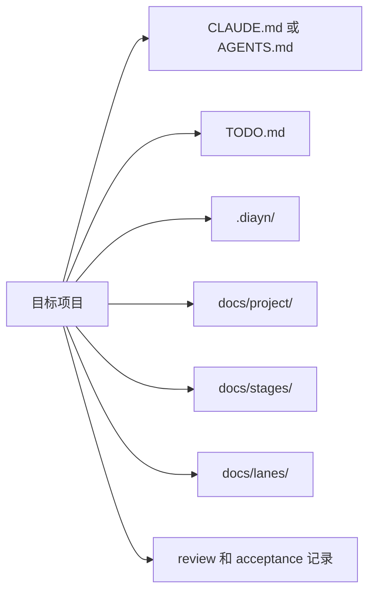

# Docs-is-all-you-need

[English](README.md)

DIAYN 是一个面向多会话 coding agent 的文档驱动工作流包。它会把一个
模糊想法或需求，逐步整理成可以规划、分工、审查、同步、集成和 Owner
验收的阶段化项目。

DIAYN 不是应用框架。它是一个 skill/plugin 包，用来帮助 coding agent
把需求、工作状态、证据和验收记录放在离项目代码足够近的位置。

## 当前状态

| 平台 | 状态 | 用户主入口 |
| --- | --- | --- |
| Claude Code plugin | 已支持 | `/diayn:*` 命令 |
| Codex Desktop plugin | 已支持 | DIAYN Codex skills，从 `$diayn-init` 开始 |
| Claude project-local fallback | 已支持的备用方式 | 裸 `/diayn-*` 命令 |
| Codex project-local package | 已支持的备用方式 | 项目内 Codex skills，例如 `$diayn-init` |
| OpenCode | TODO | 暂不声明支持 |

DIAYN 还内置了一组锁定版本的 `agent-skills` 依赖 skills。使用已支持的
DIAYN 安装方式时，用户不需要再单独安装 `agent-skills`。

## 适合谁

- 想把原始想法整理成清晰实现计划的 Owner。
- 需要多个 coding-agent 会话协作的人，例如后端、前端、审查、集成和验收。
- 想在 Claude Code 里使用 `/diayn:*` 插件工作流的用户。
- 想在 Codex Desktop 里把 DIAYN 作为 skills 安装使用的用户。

## 快速开始

### Claude Code 插件

把下面几行复制到 Claude Code 里执行：

```text
/plugin marketplace add ice268528/Docs-is-all-you-need
/plugin install diayn@diayn
/diayn:init
```

Claude Code 插件模式使用 `/diayn:*` 这种带命名空间的命令。

### Codex Desktop 插件

打开 Codex Desktop，选择“添加插件市场”，按下面填写：

```text
来源：git@github.com:ice268528/Docs-is-all-you-need.git
Git 引用：main
稀疏路径：
.agents/plugins
plugins/diayn
```

两个稀疏路径要填在同一个“稀疏路径”输入框里，每行一个。第一行提供
marketplace manifest，第二行提供 DIAYN 插件负载。

安装 DIAYN 插件后，在目标项目里从这里开始：

```text
$diayn-init initialize this project with DIAYN
```

初始化之后，按下面的命令对照表继续选择下一条 DIAYN skill。

## 核心工作流



如果证据、测试、contract 或验收标准不够，审查阶段可以把工作退回对应
lane 继续处理。

## 命令对照

| 工作流 | Claude plugin | Codex plugin | Project-local fallback |
| --- | --- | --- | --- |
| 初始化 / 改造 | `/diayn:init` | `$diayn-init` | `/diayn-init` 或 `$diayn-init` |
| 规划 | `/diayn:plan` | `$diayn-plan` | `/diayn-plan` 或 `$diayn-plan` |
| 准备 worktrees | `/diayn:worktrees` | `$diayn-worktrees` | `/diayn-worktrees` 或 `$diayn-worktrees` |
| 后端 lane | `/diayn:backend` | `$diayn-backend` | `/diayn-backend` 或 `$diayn-backend` |
| 前端 lane | `/diayn:frontend` | `$diayn-frontend` | `/diayn-frontend` 或 `$diayn-frontend` |
| 后端审查 | `/diayn:review-backend` | `$diayn-review-backend` | `/diayn-review-backend` 或 `$diayn-review-backend` |
| 前端审查 | `/diayn:review-frontend` | `$diayn-review-frontend` | `/diayn-review-frontend` 或 `$diayn-review-frontend` |
| 同步文档 / 状态 | `/diayn:sync` | `$diayn-sync` | `/diayn-sync` 或 `$diayn-sync` |
| 集成 | `/diayn:integration` | `$diayn-integration` | `/diayn-integration` 或 `$diayn-integration` |
| Bug 分流 | `/diayn:bug` | `$diayn-bug` | `/diayn-bug` 或 `$diayn-bug` |
| 新阶段 / 需求变更 | `/diayn:new` | `$diayn-new` | `/diayn-new` 或 `$diayn-new` |
| HTML 报告 | `/diayn:html` | `$diayn-html` | `/diayn-html` 或 `$diayn-html` |

fallback 列只适用于 project-local package 安装。Claude Code plugin 模式请使用
`/diayn:*`；Codex Desktop plugin 模式请使用 Codex 从插件里安装出来的 DIAYN
skills。

## DIAYN 会给目标项目添加什么



通常会生成或维护这些文件：

- 平台入口文件：Claude Code 使用 `CLAUDE.md`，Codex、OpenCode 和通用 agent
  使用 `AGENTS.md`；
- `TODO.md`：当前项目摘要；
- `.diayn/`：DIAYN 控制文件和元数据；
- `docs/project/`：项目简报、文件索引和 harness audit；
- `docs/stages/`：阶段计划、集成总结、收尾和 Owner 验收记录；
- `docs/lanes/`：backend/frontend lane board、handoff、evidence 和 review log。

这些文件是在 DIAYN 运行的目标项目里生成的，不要求全部出现在这个源码仓库里。

## 公开仓库结构

| 路径 | 用途 |
| --- | --- |
| `.claude-plugin/` 和 `.claude/commands/` | Claude Code 插件 manifest 和 `/diayn:*` command adapter |
| `.agents/plugins/` 和 `plugins/diayn/` | Codex Desktop marketplace manifest 和插件负载 |
| `skills/` | 12 个 DIAYN workflow skills 的权威来源 |
| `packages/claude-project-local/` | Claude project-local fallback 包 |
| `packages/codex-project-local/` | Codex project-local fallback 包 |
| `docs/install/` | 安装文档 |
| `docs/meta/` 和 `docs/templates/` | 稳定工作流协议和模板 |

## 参考项目

DIAYN 的 skill 打包方式和跨 agent 安装面，参考了这两个项目：

- [addyosmani/agent-skills](https://github.com/addyosmani/agent-skills)
- [obra/superpowers](https://github.com/obra/superpowers)

## 更多文档

- [安装总览](docs/install/README.md)
- [Claude Code 安装](docs/install/claude-code.md)
- [Codex Desktop plugin 安装](docs/install/codex_plugin.md)
- [Codex project-local skills package](docs/install/codex_skills.md)
- [OpenCode 状态](docs/install/opencode.md)
- [DIAYN 命令参考](docs/meta/diayn_command_reference.md)
- [项目文件索引](docs/project/file_index.md)
