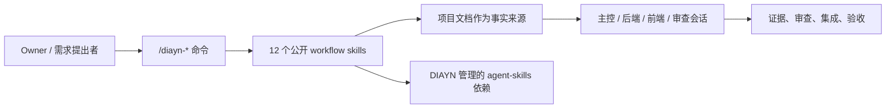
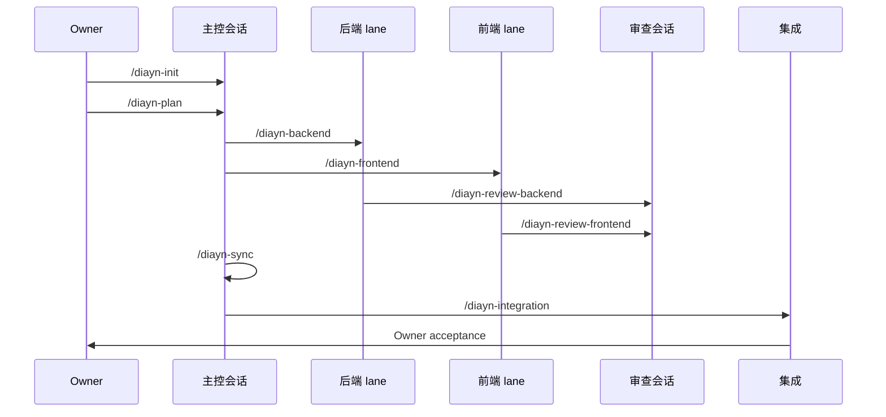

# Docs-is-all-you-need

[English](README.md)

Docs-is-all-you-need，简称 DIAYN，是一个“文档驱动、多会话 coding agent
协作”的控制层，以可安装 skill pack 的形式交付。

DIAYN V1 只暴露 12 条公开 `/diayn-*` workflow skills。Controller、
Executor、Reviewer、Integrator、Identity Guard、Owner UX、Skill Router
这些角色是内部实现参考，不是额外公开命令。



## 安装

Codex Desktop 使用 Codex Home skill package 安装。请在本仓库根目录执行。
先执行 dry-run：

```powershell
node maintainers\scripts\install_codex_project_local_package.js --target-codex-home $env:USERPROFILE\.codex
```

确认 dry-run 输出没有问题后，再执行安装：

```powershell
node maintainers\scripts\install_codex_project_local_package.js --target-codex-home $env:USERPROFILE\.codex --execute
```

这个安装会写入：

- 12 个公开 DIAYN workflow skills 到 `$CODEX_HOME/skills`；
- 23 个 DIAYN 管理的 `agent-skills` 依赖 skills；
- DIAYN 元数据到 `$CODEX_HOME/diayn/docs-is-all-you-need`。

安装命令不会删除已有用户 skills。如果之前装过旧 DIAYN 测试 skills，
请先明确清理，再重新安装。

安装完成后，打开或重新加载 Codex Desktop，在目标项目里从这个命令开始：

```text
/diayn-init
```

## 12 条公开命令

```text
/diayn-init
/diayn-plan
/diayn-worktrees
/diayn-backend
/diayn-frontend
/diayn-review-backend
/diayn-review-frontend
/diayn-sync
/diayn-integration
/diayn-bug
/diayn-new
/diayn-html
```



## 仓库里有什么

| 路径 | 作用 |
| --- | --- |
| `skills/` | DIAYN 源码工作区，包含公开 workflow 源码、内部参考源码和历史源码。它不是安装 surface。 |
| `plugins/docs-is-all-you-need/skills/` | Codex plugin candidate 的公开 surface，只包含 12 个 DIAYN workflow skills。 |
| `packages/codex-project-local/` | Codex project-local/Home 安装包。 |
| `packages/claude-project-local/` | Claude Code project-local 安装包，已完成 fixture 流程验证。 |
| `plugins/docs-is-all-you-need/dependency-skills/` | 锁定的、由 DIAYN 管理的第三方 `agent-skills` 依赖。 |
| `validation/` | 已提交的 fixture 证据和 release gate 输出。本机 runtime 证据会被忽略。 |

## 当前支持状态

| 平台 | 状态 |
| --- | --- |
| Claude Code project-local | 已完成 alpha fixture 流程验证。 |
| Codex Desktop | package 和安装 fixture 已准备好；app session runtime 需要人工验证。 |
| OpenCode | 暂缓，直到能证明可直接触发 `/diayn-*` skills。 |

Codex Desktop runtime 验证必须在 Codex Desktop 里完成。不要用从 shell
启动的 Codex 作为运行时证明。

## 继续阅读

| 需求 | 文件 |
| --- | --- |
| 安装和支持状态 | `docs/install/README.md` |
| 实现阶段 | `docs/meta/diayn_v1_implementation_plan.md` |
| 完成度审计 | `docs/meta/diayn_v1_completion_audit.md` |
| 命令行为 | `docs/meta/diayn_command_reference.md` |
| 根目录 `skills/` 为什么有额外目录 | `skills/README.md` |

长期事实写进仓库文档；聊天只用于即时协作、澄清和反馈。
