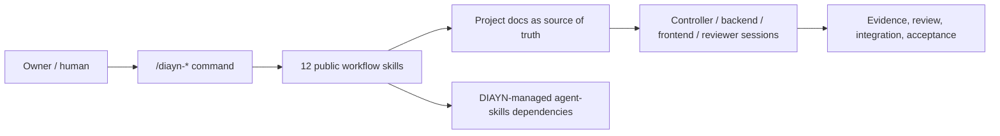
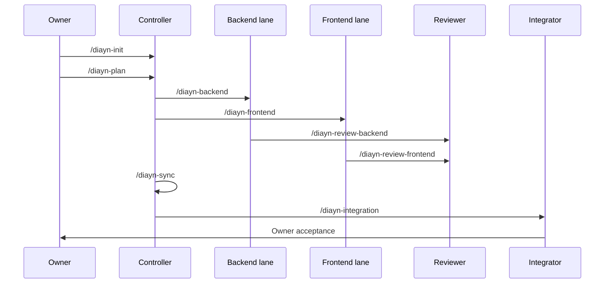

# Docs-is-all-you-need

[English](README.md)

Docs-is-all-you-need，简称 DIAYN，是一个面向多会话 coding agent 协作的文档驱动控制层，以可安装 skill pack 的形式交付。

DIAYN V1 只有 12 个公开 workflow skills。Controller、Executor、Reviewer、Integrator、Identity Guard、Owner UX、Skill Router 等角色是内部实现参考，不是额外的公开命令。Claude plugin 模式下，这些 workflow 预期通过 `/diayn:diayn-init` 这类 namespaced command 调用；裸 `/diayn-*` 属于 project-local fallback 路径。



## 安装

### Claude Code CLI

DIAYN 对 Claude Code 明确区分两条路径，不能混用它们的证据：

1. **标准 Claude Code plugin / marketplace 路径**：使用 plugin namespaced command。
2. **project-local fallback 路径**：把文件安装到目标项目 `.claude/` 下，提供裸 `/diayn-*` 短命令。

#### 标准 Plugin / Marketplace 路径

仓库根目录提供 Claude plugin 入口：

```text
.claude-plugin/plugin.json
.claude-plugin/marketplace.json
```

根 manifest 使用 `name: "diayn"`，因此预期 plugin namespace 是 `diayn`。它把命令指向 `.claude/commands` 下的薄 adapter，把 skills 指向 `packages/claude-project-local/.claude/skills`。这个 skills root 包含 12 个 DIAYN workflow skills 和 23 个锁定版本的 DIAYN-managed `agent-skills` 依赖。

DIAYN 现在不声明已经进入 Anthropic 官方 marketplace。GitHub marketplace-style 安装的目标形式是：

```text
/plugin marketplace add ice268528/Docs-is-all-you-need
/plugin install diayn@<marketplace-name>
```

发布前的本地 plugin 开发可以这样运行：

```powershell
claude --plugin-dir <path-to-this-repo>
```

预期 plugin 命令格式是：

```text
/diayn:diayn-init
/diayn:diayn-plan
/diayn:diayn-backend
```

本版本没有实现 `/diayn:init` 这种短 namespaced alias。它需要额外 command alias wrapper 和 runtime 验证。Plugin 模式也不承诺裸 `/diayn-*`，除非后续 Claude Code runtime 测试证明支持。

旧的 inner candidate 仍可用于聚焦的本地 plugin-dir 调试：

```powershell
claude --plugin-dir <path-to-this-repo>\plugins\docs-is-all-you-need
```

Claude plugin candidate 包含：

```text
.claude-plugin/plugin.json
.claude-plugin/marketplace.json
.claude/commands/diayn-*.md
plugins/docs-is-all-you-need/.claude-plugin/plugin.json
plugins/docs-is-all-you-need/.claude/commands/diayn-*.md
plugins/docs-is-all-you-need/skills/diayn-*/
plugins/docs-is-all-you-need/dependency-skills/
```

#### Project-Local Fallback 路径

如果你明确想在目标项目里使用裸 `/diayn-*` 短命令，就使用 fallback。它会向目标项目写入 `.claude/` 和 `.diayn/` 文件：

```text
.claude/commands/diayn-*.md
.claude/skills/diayn-*/
.claude/skills/<agent-skills-name>/
.diayn/dependency-routing/upstream-routing-map.md
.diayn/internal-role-skills/
.diayn/dependency-skills-manifest.json
```

fallback 包来源是：

```text
packages/claude-project-local/
```

project-local 安装后，从这个命令开始：

```text
/diayn-init
```

这是本地短命令安装，不是 plugin / marketplace 路径支持裸 `/diayn-*` 的证据。

### Codex Desktop

仓库根目录提供 Codex plugin 入口：

```text
.codex-plugin/plugin.json
```

它指向 `packages/codex-project-local/.codex/skills/`，其中包含 12 个 DIAYN workflow skills 和 23 个 DIAYN-managed dependency skills。旧的 inner Codex plugin candidate 仍保留在 `plugins/docs-is-all-you-need/`，用于本地打包实验。

Codex package/install 验证只运行安装命令并检查目录结构；它不启动 Codex Desktop，也不声明 app-session runtime discovery 已通过。要从仓库根目录安装 Codex Home skill package，先 dry-run：

```powershell
node maintainers\scripts\install_codex_project_local_package.js --target-codex-home $env:USERPROFILE\.codex
```

确认 dry-run 结果后执行安装：

```powershell
node maintainers\scripts\install_codex_project_local_package.js --target-codex-home $env:USERPROFILE\.codex --execute
```

这会安装：

- 12 个公开 DIAYN workflow skills 到 `$CODEX_HOME/skills`；
- 23 个 DIAYN-managed `agent-skills` dependency skills；
- DIAYN 元数据到 `$CODEX_HOME/diayn/docs-is-all-you-need`。

安装命令不会删除用户已有 skills。如果存在旧的 DIAYN 测试 skills，需要有意清理后再重装。

安装后，可以在目标项目中手动试用：

```text
/diayn-init
```

当前 Codex 声明只到 `codex_package_install`：包结构、安装命令和目录检查已验证。Codex Desktop app-session 里的直接 `/diayn-*` 调用和原生 dependency-skill 调用需要单独 runtime 证据。

### 第三方 Skill 路由

DIAYN 携带 23 个锁定版本的第三方 `agent-skills`，作为 DIAYN-managed dependency skills。它们不是额外的公开 DIAYN 命令。`/diayn-*` workflow 先负责 role、lane、state、review、integration、evidence 和 Owner 边界，然后 DIAYN router 再选择最小必要的 dependency skill set。

dependency skill id 按安装 surface 解析。Project-local 安装使用 `idea-refine` 这类名称；Claude plugin namespace 安装可能需要 `diayn:idea-refine`；Codex 使用已安装 skills root 里发现的 skill id。

路由表在：

```text
maintainers/internal-skills/diayn-skill-router/references/upstream-routing-map.md
```

当前证据证明了 Claude Code project-local 的代表性原生路由调用：`/diayn-init` 在模糊 idea 场景下，通过原生 `Skill` tool 路由到 DIAYN-managed `idea-refine` skill。包内包含全部 23 个 dependency skills 和每个 skill 的 routing rationale，但不声明每个 dependency skill 都已经在真实 workflow 中穷尽验证。

Claude skill authoring 的本地维护参考是 Anthropic 官方 skills 仓库：

```text
git@github.com:anthropics/skills.git
```

## 公开命令

project-local fallback 的裸命令是：

```text
/diayn-init
/diayn-plan
/diayn-worktrees
/diayn-backend
/diayn-frontend
/diayn-review-backend
/diayn-review-frontend
/diayn-sync
/diayn-integration
/diayn-bug
/diayn-new
/diayn-html
```

Claude plugin 模式下对应的预期 namespaced command 是 `/diayn:diayn-*`，例如 `/diayn:diayn-init`。



## 仓库内容

| 路径 | 用途 |
| --- | --- |
| `skills/` | 公开 DIAYN workflow 源文件，只包含 12 个 `diayn-*` skills。 |
| `maintainers/internal-skills/` | 维护者内部 role/router/scaffold 源文件，不是公开可安装 skill surface。 |
| `plugins/docs-is-all-you-need/` | Claude/Codex plugin candidate。 |
| `packages/codex-project-local/` | Codex project-local/Home install package。 |
| `packages/claude-project-local/` | Claude Code 裸命令开发和验证 package。 |
| `plugins/docs-is-all-you-need/dependency-skills/` | 锁定版本的 DIAYN-managed 第三方 `agent-skills` payload。 |

维护者验证输出位于本地 `validation/`，并被 Git 忽略。它们用于实现和发布检查，不作为普通用户需要的仓库内容上传。

## 当前支持状态

| Surface | 状态 |
| --- | --- |
| Claude Code plugin candidate | 标准安装目标；本地 plugin-dir 可验证 plugin 结构。预期命令是 `/diayn:diayn-*`，仍需要 runtime 证明。 |
| Claude Code project-local package | 已证明裸 `/diayn-*` installed flow 的开发/fallback package；不是最终 marketplace 安装模型。 |
| Codex package/install | 已验证包结构、安装命令和目录检查；Desktop app-session runtime 需要单独证据。 |
| OpenCode | 延后，直到能证明直接 `/diayn-*` skill 调用。 |

不要把 shell 启动的 Codex 或安装输出检查当成 Codex Desktop app-session runtime 证明。

## 下一步阅读

| 需求 | 文件 |
| --- | --- |
| 安装和支持真相 | `docs/install/README.md` |
| 实施阶段 | `docs/meta/diayn_v1_implementation_plan.md` |
| 完成度审计 | `docs/meta/diayn_v1_completion_audit.md` |
| 命令行为 | `docs/meta/diayn_command_reference.md` |
| 公开 `skills/` 说明 | `skills/README.md` |
| 内部源文件说明 | `maintainers/internal-skills/README.md` |

把稳定事实写进仓库文档。聊天只用于即时协调、澄清和用户反馈。
