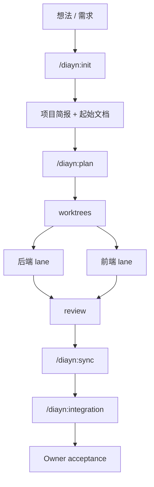
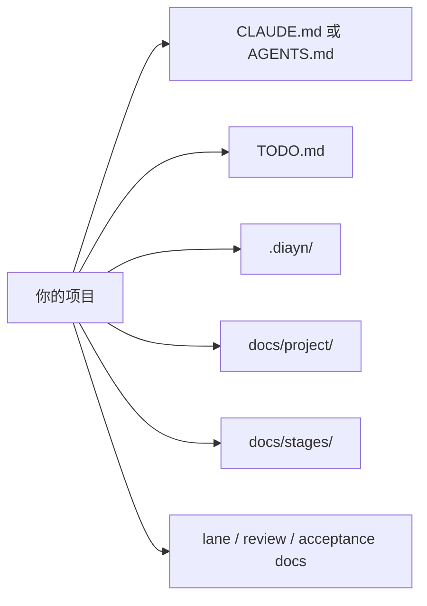

# Docs-is-all-you-need

[English](README.md)

Docs-is-all-you-need，简称 DIAYN，是一个面向多会话 coding agent 协作的文档驱动 workflow pack。它帮助你把一个模糊想法或需求，逐步变成一个可以规划、分工、审查、同步和验收的项目，而且不会让项目事实在多轮对话中漂移。

## 适合谁

- 想把一个想法整理成清晰项目计划的 Owner。
- 需要多个 agent 会话协作、并保持同一份项目事实的团队。
- 想用 Claude Code 插件方式开始 DIAYN 的用户。
- 想在 Codex 中使用当前 skills 安装包，或想测试 Codex Desktop 插件
  candidate 的用户。

## 快速开始

### Claude Code 插件安装

把下面两行复制到 Claude Code 里执行：

```text
/plugin marketplace add ice268528/Docs-is-all-you-need
/plugin install diayn@diayn-local-alpha
```

然后从这里开始：

```text
/diayn:init
```

DIAYN 会在需要时继续追问你，帮助澄清需求，然后创建项目所需的文档和起始文件。

### Codex Desktop 插件 candidate

Codex Desktop 当前通过应用界面添加插件市场；这个插件 candidate 不要求你使用
Codex CLI。

在 Codex Desktop 里打开“添加插件市场”，填写：

```text
来源：git@github.com:ice268528/Docs-is-all-you-need.git
Git 引用：main
稀疏路径：plugins/codex
```

然后把插件列表筛选器从 `Built by OpenAI` 切到全部或对应市场，再搜索
`diayn`。这条路径仍是 candidate，只有新的 Codex Desktop 安装、发现和调用
证据跑通后，才能声明 runtime 已验证。

## 核心工作流



如果 review 发现问题，工作会被送回对应 lane 继续处理。

## 常用命令

下表展示 Claude Code plugin 命令和 Claude project-local fallback 形式。
Codex 当前已验证的是 skills package；Codex 中直接 slash 调用的行为仍需要
Desktop runtime 证据。

| Workflow | Command | When to use |
| --- | --- | --- |
| 初始化 / 改造 | `/diayn:init`（fallback 中是 `/diayn-init`） | 从一个想法开始，或者把 DIAYN 接入现有项目。 |
| 计划 | `/diayn:plan`（`/diayn-plan`） | 把当前目标拆成阶段、任务和分工。 |
| worktrees | `/diayn:worktrees`（`/diayn-worktrees`） | 在真正开发前准备 lane 工作区。 |
| 后端 lane | `/diayn:backend`（`/diayn-backend`） | 处理当前阶段的后端任务。 |
| 前端 lane | `/diayn:frontend`（`/diayn-frontend`） | 处理当前阶段的前端任务。 |
| 后端审查 | `/diayn:review-backend`（`/diayn-review-backend`） | 在合并或交接前审查后端结果。 |
| 前端审查 | `/diayn:review-frontend`（`/diayn-review-frontend`） | 在合并或交接前审查前端结果。 |
| 同步文档 / 状态 | `/diayn:sync`（`/diayn-sync`） | 同步 lane 状态、文档和共享项目事实。 |
| 集成 | `/diayn:integration`（`/diayn-integration`） | 在结束一个阶段前检查最终合并结果。 |
| Bug 分流 | `/diayn:bug`（`/diayn-bug`） | 处理新 bug 或意外失败。 |
| 新阶段 | `/diayn:new`（`/diayn-new`） | 开始下一阶段，或者记录一块新的工作。 |
| HTML 报告 | `/diayn:html`（`/diayn-html`） | 生成或刷新 DIAYN 文档的 HTML 视图。 |

## DIAYN 会给项目添加什么



常见会生成或维护的文件包括：

- 平台入口文件：`CLAUDE.md` 或 `AGENTS.md`
- `TODO.md`：当前项目摘要
- `.diayn/`：DIAYN 控制文件和元数据
- `docs/project/`：项目简报和文件索引
- `docs/stages/`：阶段级文档
- lane、review、acceptance 文档：用于当前工作流

## 其他安装方式

- Claude project-local fallback：当你想在目标项目里直接使用裸
  `/diayn-*` 命令时使用这条路径。详情见
  [docs/install/claude-code.md](docs/install/claude-code.md)。
- Codex：当前已验证的是安装到 `.codex/skills/` 或 Codex Home skills
  的 skills package。Codex Desktop plugin marketplace candidate 使用
  `稀疏路径：plugins/codex`，但还没有 runtime 证据。详情见
  [docs/install/codex_skills.md](docs/install/codex_skills.md) 和
  [docs/install/codex_plugin_local_candidate.md](docs/install/codex_plugin_local_candidate.md)。
- OpenCode / generic：详情见
  [docs/install/README.md](docs/install/README.md)。

## 更多文档

如果你想看用户入口背后的细节，可以继续读：

- [docs/install/README.md](docs/install/README.md)
- [docs/install/claude-code.md](docs/install/claude-code.md)
- [docs/install/codex_skills.md](docs/install/codex_skills.md)
- [docs/install/codex_plugin_local_candidate.md](docs/install/codex_plugin_local_candidate.md)
- [docs/install/codex_desktop_marketplace_fix_report.md](docs/install/codex_desktop_marketplace_fix_report.md)
- [docs/qa/claude-plugin-runtime-acceptance.md](docs/qa/claude-plugin-runtime-acceptance.md)
- [docs/meta/diayn_command_reference.md](docs/meta/diayn_command_reference.md)
- [docs/meta/diayn_commands/](docs/meta/diayn_commands/)
- [docs/meta/diayn_v1_implementation_plan.md](docs/meta/diayn_v1_implementation_plan.md)
- [docs/project/file_index.md](docs/project/file_index.md)
